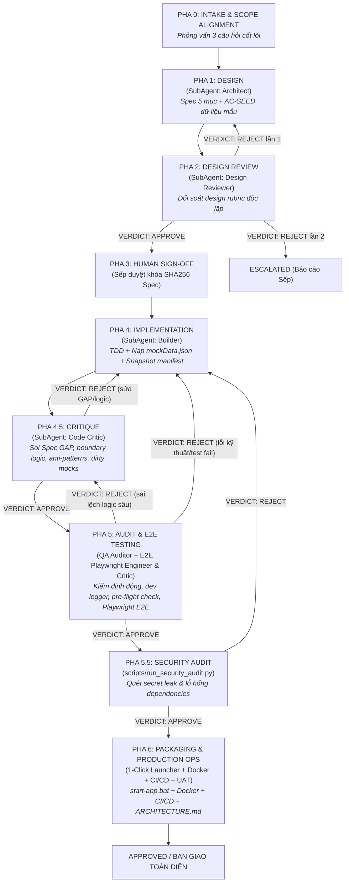
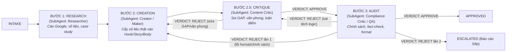

# Antigravity-Harness-Hub
> **Bộ Harness Đa Nhiệm & Phản Biện Tự Động 2.0**

`Antigravity-Harness-Hub` là khung điều phối (harness framework) tự hành chuẩn hóa quy trình phát triển đa lĩnh vực (Phần mềm & Tiếp thị/Nội dung). Hệ thống kết hợp cơ chế phân vai tác tử chuyên môn hóa, cỗ máy trạng thái (State Machine), và rào chắn kiểm định chất lượng đối nghịch (Adversarial Quality Gate) tích hợp cầu dao ngắt mạch (Circuit Breaker) chống kẹt vòng lặp sau tối đa 2 lượt phản biện.

> ### ⚠️ Ranh giới thực tế giữa 2 tầng (đọc trước khi dùng)
>
> | Tầng | Vai trò thật | Ai chạy |
> | :--- | :--- | :--- |
> | `GEMINI.md` / `AGENTS.md` + `agents/` + `rubrics/` + `plugins/*/skills/` | **Bộ luật vận hành thật** — quy định Quản đốc phân vai, gọi subagent, gọi skill theo slash command | Antigravity 2.0 (đọc trực tiếp trong IDE) |
> | `harness/orchestrator.py` + `harness/runners/` | **Mô phỏng state machine**, không gọi LLM hoặc tự sinh nội dung | CLI không có checkpoint flag (dev/CI) |
> | `harness/app_workflow.py` + `harness/marketing_workflow.py` | **Checkpoint stores thật**: khóa hash/evidence/gates, không chạy agents/browser hoặc publish | CLI `--workflow` / `--marketing-workflow` do native orchestrator gọi |
>
> Muốn agent *viết nội dung thật*, nó phải chạy trong Antigravity theo `GEMINI.md`. Checkpoint không thay thế dispatch native. Human Spec gate là behavior app sản phẩm; không tạo signoff giả hoặc gate mới cho bảo trì harness đã được Sếp giao.

Hướng dẫn: [App local và schema 2](docs/app-workflow-guide.md), [Marketing content/research-only và publishing local](docs/marketing-workflow-guide.md), [Native readiness và portable smoke](docs/native-readiness.md). Antigravity E2E: NOT_VERIFIED cho đến khi có native evidence thật; model/tool metadata không chứng minh availability/sandbox/isolation.


---

## MCP Server cho skill `framework-marketing-da-kenh`

Skill marketing đa kênh truy vấn MCP server của Noti. Cần thêm server vào ứng dụng AI trước khi dùng:

- URL endpoint (JSON-RPC, dán vào phần "thêm MCP server" của ứng dụng): `https://go.noti.vn/cong-cu/framework-marketing-da-kenh/mcp`
- Tên server gợi ý: `noti-framework-marketing` (đã khai trong `plugins/marketing/mcp_config.json`)
- Server cung cấp 8 tool `framework_*`; schema đã kiểm chứng lưu tại `plugins/marketing/skills/framework-marketing-da-kenh/references/mcp-tools-schema.json`
- Chưa cấu hình MCP vẫn dùng được skill ở **chế độ khung tĩnh** (6 pha + nhóm kênh + 6 loại liên kết), nhưng mất phần khối việc chi tiết và link sơ đồ.

## 1. Cấu Trúc Thư Mục Dự Án

```
Antigravity-Harness-Hub/
├── agents/                                 # Đặc tả vai trò và trách nhiệm của từng tác tử
│   ├── app/                                # Tác tử khối Kỹ thuật / Lập trình (App)
│   │   ├── architect.md                    # System Architect (Thiết kế hệ thống & Spec 5 mục)
│   │   ├── design_reviewer.md              # Design Reviewer (Thẩm định độc lập Spec kiến trúc)
│   │   ├── builder.md                      # Developer (Lập trình mã nguồn & unit test)
│   │   ├── code_critic.md                  # Code Critic (Soi Spec GAP, boundary logic, anti-patterns, dirty mocks)
│   │   ├── qa_auditor.md                   # QA Reviewer (Kiểm thử độc lập, bảo mật & browser evidence)
│   │   ├── e2e_engineer.md                 # E2E Automation Engineer (Kịch bản Playwright E2E)
│   │   └── e2e_critic.md                   # E2E Test Critic (Thẩm định kịch bản E2E độc lập)
│   ├── marketing/                          # Tác tử khối Tăng trưởng / Nội dung (Marketing)
│   │   ├── web_researcher.md               # Web & Market Intelligence Researcher
│   │   ├── creator.md                      # Content Creator (Soạn kịch bản & copy chuyển đổi cao)
│   │   └── compliance_critic.md            # Policy Reviewer (Rà soát chính sách, lọc AI slop)
│   ├── registry.md                         # Bảng đăng ký định danh & quyền hạn tác tử
│   └── synthesizer.md                      # Tác tử tổng hợp tri thức & giải pháp
├── docs/                                   # Tài liệu hướng dẫn & quy chuẩn vận hành
│   ├── app-workflow-guide.md               # Cẩm nang Gemini Native App Workflow & Checkpoint Guide
│   ├── intake-protocol.md                  # Giao thức phỏng vấn Intake 3 câu hỏi trước khi lập Spec
│   └── human-test-sheet-template.md        # Mẫu biểu kiểm thử UAT dành cho người dùng cuối
├── plugins/                                # Các Plugin đóng gói chuẩn Antigravity (skills + manifest + scripts)
│   ├── code/skills/                        # 21 skill kỹ thuật (SKILL.md + references/ + scripts/)
│   ├── marketing/skills/                   # 13 skill marketing / nội dung (SKILL.md + references/ + scripts/)
│   └── impeccable/                         # Plugin độc lập hoàn thiện & kiểm định UI Frontend (59 detector rules, 24 commands)
│       ├── plugin.json                     # Manifest plugin độc lập
│       └── skills/impeccable/              # SKILL.md + reference/ (24 commands) + scripts/ (detect.mjs, engines)
├── .agent/ , .agents/                      # Khai báo search path cho Antigravity (skills.json, plugins.json)
├── .brain/                                 # Dữ liệu runtime (trajectories, learnings) — KHÔNG commit
├── scripts/                                # Tiện ích tự động hóa & vận hành Production
│   ├── run_security_audit.py               # Quét bảo mật dependency vulnerabilities & secret leak
│   ├── generate_launcher.py                # 1-click launcher (start-app.bat) + cờ --docker (Dockerfile, docker-compose.yml, .github/workflows/ci.yml, ARCHITECTURE.md)
│   ├── run_dev_logger.py                   # Quản lý tiến trình nền dev server & Pre-flight check (port, health)
│   ├── session_manager.py                  # Đồng bộ session di động giữa các máy
│   └── apify_crawler.py                    # Thu thập dữ liệu mạng xã hội qua Apify
├── configs/                                # Tệp cấu hình phân tầng model và giới hạn vận hành
│   └── harness_config.json                 # Model tier, roles, max_rounds, skill_routing (34 skill)
├── harness/                                # Lõi thực thi (Harness Core Engine)
│   ├── app_workflow.py                     # Quản lý vòng đời checkpoint, evidence deduplication & consistency sweep
│   ├── orchestrator.py                     # ChiefOrchestrator: Bộ điều phối trung tâm
│   ├── quality_gate.py                     # AdversarialQualityGate & Verdict logic
│   ├── state_machine.py                    # Cỗ máy trạng thái (HarnessState & TaskContext)
│   ├── memory/                             # Vòng lặp tự học & bộ nhớ trajectory (harvester.py, distiller.py, trajectory.py)
│   ├── skills/                             # Quản lý vòng đời skill, staging, routing (curator.py, manager.py, router.py)
│   └── runners/                            # Các Runner thực thi theo phân nhánh
│       ├── app_runner.py                   # Luồng vận hành nhánh Build App
│       └── marketing_runner.py             # Luồng vận hành nhánh Marketing
├── rubrics/                                # Bộ tiêu chí đánh giá nghiệm thu chuẩn hóa
│   ├── design_review_rubric.md             # Tiêu chuẩn thẩm định thiết kế kiến trúc & Spec 5 mục
│   ├── code_critique_rubric.md             # Tiêu chuẩn phản biện logic, spec GAP, clean architecture
│   ├── code_quality_rubric.md              # Tiêu chuẩn chất lượng code, test, OWASP, UI verification
│   └── content_compliance_rubric.md        # Tiêu chuẩn chính sách nền tảng, chống AI slop
├── tests/                                  # Bộ kiểm thử tự động (25 files, 407 tests)
│   ├── test_app_workflow.py                # Checkpoint store, review gate, verify-browser & evidence deduplication
│   ├── test_generate_launcher_production.py # Kiểm thử sinh launcher mở rộng Docker, CI/CD, ARCHITECTURE.md
│   ├── test_harness_core.py                # Unit test: State machine, Quality gate, Routing
│   ├── test_harness_e2e.py                 # E2E test: Luồng phản biện 2 vòng, Escalate
│   ├── test_launcher_and_dev_logger.py     # Kiểm thử tiện ích dev logger & 1-click launcher generator
│   ├── test_marketing_skills.py            # Frontmatter & loader của skill
│   ├── test_run_security_audit.py          # Kiểm thử quét bảo mật dependencies & secret leak
│   ├── test_session_manager.py             # Portable session sync
│   ├── test_skill_router.py                # Keyword routing
│   ├── test_triad_protocol.py              # Kiểm chứng Dynamic Triad, Smart Feedback Loop, Circuit Breakers
│   └── test_repo_integrity.py              # Chặn lỗi: thư mục lồng, file rác, secret, path cá nhân, ref gãy
├── setup/                                  # Cài đặt cấu hình môi trường mới
│   ├── config.json                         # Cấu hình Antigravity plugins & userSettings chuẩn
│   └── setup.ps1                           # Merge defaults, hỗ trợ -TargetDirectory/-SkipSessionRestore
├── run_harness.py                          # Giao diện dòng lệnh CLI chính của hệ thống (Task & Workflow checkpoint)
└── README.md                               # Tài liệu hướng dẫn chi tiết
```

### Mô Tả Chi Tiết Các Tệp Tin

| Tệp tin / Thư mục | Trách nhiệm chính |
| :--- | :--- |
| `harness/app_workflow.py` | Quản lý vòng đời Checkpoint cho nhánh App (`WorkflowStore`): kiểm soát chuyển trạng thái, thẩm định chữ ký SHA256 Spec/Manifest, tự động khử trùng lặp bằng chứng (evidence deduplication) và quét sạch trạng thái cũ (consistency auto-sweep). |
| `docs/app-workflow-guide.md` | Hướng dẫn chi tiết luồng vận hành chuẩn Native Gemini App Workflow: hợp đồng vai trò, tiêu chuẩn nghiệm thu và quy trình tái tục nhiệm vụ (resume). |
| `docs/intake-protocol.md` | Giao thức phỏng vấn Intake 3 câu hỏi cốt lõi trước khi lập Spec kiến trúc, chống giả định ngầm. |
| `docs/human-test-sheet-template.md` | Mẫu bảng kiểm thử UAT chuẩn hóa (Human Test Sheet) dành cho người dùng nghiệm thu thủ công trong 3 phút. |
| `scripts/run_security_audit.py` | Quét bảo mật toàn diện: phát hiện hardcoded secrets (API keys, Tokens, Private Keys, DB URLs) và kiểm tra lỗ hổng dependency (`npm audit`, `pip-audit`). Hỗ trợ cờ `--fail-on-critical` và xuất báo cáo JSON/Markdown. |
| `scripts/run_dev_logger.py` | Quản lý tiến trình nền dev server, stream log ra file và thực hiện Pre-flight Check (port, health status 200). |
| `scripts/generate_launcher.py` | Tự động quét môi trường ứng dụng và sinh file khởi chạy 1-click `start-app.bat` kèm cẩm nang `HDSD-NHANH.md`. Hỗ trợ tùy chọn `--docker` để sinh trọn bộ Dockerfile, `docker-compose.yml`, `.github/workflows/ci.yml`, `.env.example` và `ARCHITECTURE.md`. |
| `agents/app/code_critic.md` | Tác tử phản biện mã nguồn độc lập (Code Critic): chuyên sâu soi rọi Spec GAP, boundary logic, anti-patterns, dirty mocks trước khi chuyển sang QA. |
| `agents/app/e2e_engineer.md` | Tác tử lập trình kịch bản Playwright E2E tự động hóa kiểm thử giao diện theo tiêu chuẩn Page Object Model. |
| `agents/app/e2e_critic.md` | Tác tử kiểm định độc lập kịch bản Playwright E2E (phát hiện hardcoded sleep, selector mong manh, thiếu assertion). |
| `harness/state_machine.py` | Định nghĩa các trạng thái (`INIT`, `INTAKE`, `DESIGN`, `IMPLEMENTATION`, `CRITIQUE`, `AUDIT`, `APPROVED`, `REJECTED`, `ESCALATED`) và quản lý bước chuyển trạng thái hợp lệ, ngăn chặn việc nhảy cóc quy trình. |
| `harness/quality_gate.py` | Kiểm tra định dạng phán quyết của Checker (`VERDICT: APPROVE`, `REJECT`, `ESCALATE`); cung cấp phương thức `evaluate_critique`, `evaluate_audit` cùng các bộ đếm độc lập `critique_rounds`, `qa_rounds`, `total_cycles` phục vụ Decoupled Circuit Breakers. |
| `harness/orchestrator.py` | Khởi tạo môi trường, tiếp nhận yêu cầu từ người dùng, nạp `TaskContext`, chuyển giao cho Runner thích hợp và gửi kết quả thẩm định. |
| `harness/runners/` | Đóng gói chu trình 4 bước gồm Maker ➔ Critic ➔ QA Auditor cho từng nhánh (hỗ trợ cờ `fast_track` cho Tier 2 / Hotfix): `app_runner.py` (Architect → Builder → Code Critic → QA Auditor) và `marketing_runner.py` (Researcher → Creator → Content Critic → Compliance Critic/QA). Runner là nơi ghi trace từng bước. |
| `harness/memory/` | Vòng lặp tự học & bộ nhớ quỹ đạo (Trajectory): thu hoạch bài học kinh nghiệm (`harvester.py`), chưng cất kỹ năng mới (`distiller.py`) và lưu trữ lịch sử thực thi (`trajectory.py`). |
| `harness/skills/` | Quản lý vòng đời kỹ năng: định tuyến theo từ khóa (`router.py`), quản lý hàng đợi staging và phê duyệt (`manager.py`), đánh giá chất lượng và phát hiện trùng lặp (`curator.py`). |
| `configs/harness_config.json` | Khai báo model tier (`pro`/`flash`), `roles`, `limits` và `skill_routing` (34 skill → keyword). **Lưu ý:** chưa có code nào resolve/gọi model — đây là metadata cấu hình, cần adapter LLM mới dùng được. |
| `plugins/impeccable/` | Plugin độc lập chuyên sâu về thiết kế, hoàn thiện và kiểm định giao diện Frontend (`plugin.json` + `skills/impeccable/`). Tích hợp 24 lệnh con thiết kế và bộ máy quét 59 detector rules chống AI Slop & lỗi giao diện. |
| `plugins/impeccable/skills/impeccable/scripts/detect.mjs` | Công cụ CLI kiểm định UI tĩnh độc lập (`impeccable detect`): quét mã nguồn HTML, CSS, JSX, TSX hoặc URL trình duyệt để phát hiện 59 anti-patterns, hỗ trợ output JSON cho QA Auditor tích hợp tự động. |
| `rubrics/code_critique_rubric.md` | Tiêu chuẩn phản biện logic, spec GAP, boundary edge-cases và clean architecture dành cho Code Critic; tích hợp nguyên tắc Reality Checker (mặc định 'NEEDS WORK', miễn dịch với fantasy approval, chặn pass ảo/dirty mocks). |
| `rubrics/design_review_rubric.md` | Tiêu chuẩn thẩm định thiết kế kiến trúc & Spec 5 mục; tích hợp tiêu chuẩn 'UI Finish-Gate & Anti-Generic Contract' (bài trừ generic UI, bắt buộc design contract & bespoke components). |
| `rubrics/` | Định nghĩa các checklist khắt khe độc lập mà Checker bắt buộc phải đối chiếu khi đánh giá (`design_review_rubric.md`, `code_critique_rubric.md`, `code_quality_rubric.md`, `content_compliance_rubric.md`). |

---

## 2. Luồng Điều Phối Theo Phân Nhánh

Hệ thống hoạt động theo **Cơ Chế Bộ Ba Tác Tử Linh Hoạt (Dynamic Triad Protocol: Maker ➔ Critic ➔ QA Auditor)**, nâng cấp từ nguyên tắc Maker-Checker kinh điển nhằm phân định tuyệt đối giữa thực thi, phản biện sâu logic và kiểm định động khách quan:

1. **Phân định 3 vai trò độc lập:**
   - **Maker (Thực thi - Builder / Content Creator):** Trực tiếp viết mã nguồn, hiện thực hóa tính năng, viết tests hoặc soạn bản thảo. Maker tuyệt đối không tự phê duyệt sản phẩm của mình.
   - **Critic (Phản biện sâu - Code Critic / Content Critic):** Soi rọi chuyên sâu vào logic, boundary conditions, anti-patterns, dirty mocks, spec GAP, Voice of Customer và sự toàn vẹn trước khi cho phép chuyển tiếp. Critic không sửa code hay chạy test môi trường động.
   - **QA Auditor (Kiểm định khách quan):** Kiểm định động, tự chạy lại toàn bộ test suite, rà soát an toàn bảo mật (Zero hardcoded secrets, Zero critical vulnerabilities), kiểm tra endpoint `/health`, thu thập browser evidence và local preview thực tế.
2. **Cầu dao ngắt mạch tách biệt (Decoupled Circuit Breakers):**
   - Hạn ngạch phản biện Critic: `critic_rounds <= 2`.
   - Hạn ngạch kiểm định QA: `qa_rounds <= 2`.
   - Tổng chu trình toàn cục: `total_cycles <= 3`.
   - Vượt quá bất kỳ hạn ngạch nào ở trên, hệ thống lập tức kích hoạt ngắt mạch, chuyển sang trạng thái `ESCALATED`, dừng vòng lặp và báo cáo nguyên nhân/bằng chứng trực tiếp cho Sếp để xin chỉ đạo.
3. **Vòng lặp phản hồi thông minh (Smart Feedback Loop):**
   - **Lỗi kỹ thuật / test fail / secret leak:** Maker sửa và trả thẳng cho QA Auditor test lại mà không cần qua lại Critic.
   - **Lỗi sai lệch kiến trúc / logic / Spec GAP:** Maker sửa và bắt buộc qua Critic duyệt lại trước khi chuyển sang QA Auditor.
4. **Phân tầng nhiệm vụ linh hoạt (Task Tiering):**
   - **Tier 1 (Core Task / App / Feature lớn):** Bắt buộc chạy đầy đủ chu trình Bộ Ba Tác Tử: Maker ➔ Critic ➔ QA Auditor.
   - **Tier 2 (Minor Task / Hotfix cấp tốc):** Chạy Fast-Track tinh gọn: Maker ➔ QA Auditor (cờ `fast_track=True`, vẫn đảm bảo kiểm định động và quét bảo mật nghiêm ngặt).
5. **Quy Chuẩn Biên Bản Giao Nhận Chuẩn Hóa (Standard Handoff Protocol — Maker ➔ Critic ➔ QA Auditor):**
   - **Tôn chỉ chống thất thoát ngữ cảnh (Zero Context Loss):** Mọi lượt chuyển giao nhiệm vụ, bàn giao bản thảo/mã nguồn hoặc phản hồi kết quả kiểm định giữa các tác tử bắt buộc phải tuân theo cấu trúc Biên Bản Giao Nhận chuẩn mực gồm 5 thành phần:
     + **Metadata:** Người gửi (`From`), Người nhận (`To`), Pha/Chặng (`Phase`), Mã tác vụ (`Task Reference/ID`), Mức độ ưu tiên (`Priority`), Mốc thời gian (`Timestamp`).
     + **Ngữ cảnh thực tế (Context):** Hiện trạng hoàn thành chi tiết (`Current State`), Danh sách file liên quan (`Relevant Files`), Phụ thuộc (`Dependencies`), Ràng buộc kỹ thuật (`Constraints`).
     + **Yêu cầu & Tiêu chí nghiệm thu (Deliverable & Acceptance Criteria Checklist):** Mô tả rõ ràng sản phẩm bàn giao, danh sách các tiêu chí nghiệm thu dạng checklist `[ ] Criterion` có thể đo lường và kiểm chứng độc lập.
     + **Bằng chứng thực chứng bắt buộc (Empirical Evidence):** File diffs, logs thực thi lệnh, screenshots đa thiết bị (desktop/tablet/mobile), kết quả test suite — tuyệt đối cấm bàn giao hay phê duyệt suông mà không có bằng chứng đính kèm.
     + **Trạng thái phán quyết (Verdict & Feedback Loop):** Bàn giao kết quả kiểm định với phán quyết rõ ràng: `PASS` (kèm chứng cứ xác thực) hoặc `FAIL` (kèm Issue description, Expected vs Actual, Evidence, file cần sửa và hướng dẫn retry giới hạn tối đa 2 lần trước khi kích hoạt ngắt mạch).

### 2.1. Nhánh 1: Phát Triển Phần Mềm (`app`) — Gemini Native App Workflow

Quy trình phát triển phần mềm tuân thủ nghiêm ngặt mô hình Gemini Native App Workflow toàn diện với cơ chế Maker-Checker 2 tầng (Kiến trúc & Mã nguồn), kiểm thử tự động E2E Playwright, rà soát an toàn bảo mật (Security Audit) và đóng gói Production Ops (1-Click Launcher, Docker, CI/CD):



1. **Pha 0 - INTAKE & SCOPE ALIGNMENT (Phỏng vấn 3 câu hỏi cốt lõi):**
   - **Tài liệu quy chuẩn:** `docs/intake-protocol.md`.
   - **Nhiệm vụ:** Trước khi viết một dòng Spec nào, Quản đốc bắt buộc dừng lại phỏng vấn Sếp 3 câu hỏi cốt lõi: (1) Mục tiêu & Người dùng chính, (2) Khung công nghệ & Phạm vi (Scope In/Out), (3) Ràng buộc kỹ thuật & Tiêu chí nghiệm thu (Acceptance Criteria). Tránh tuyệt đối bệnh "giả định ngầm" và lập trình sai hướng.
2. **Pha 1 - DESIGN (Architect + AC-SEED dữ liệu mẫu bắt buộc):**
   - **Tác tử:** `agents/app/architect.md` (System Architect).
   - **Nhiệm vụ:** Tiếp nhận Intake, phân tích ranh giới chức năng (blast radius), thiết kế kiến trúc phân lớp, Schema dữ liệu, hợp đồng API và danh sách Acceptance Criteria có ID rõ ràng. BẮT BUỘC thiết kế tối thiểu 1 tiêu chí `AC-SEED` chỉ định cấu trúc và nội dung dữ liệu mẫu phong phú ban đầu (`mockData.json` / seeds) để người dùng mở app lên là thấy dữ liệu sống ngay lập tức, không để màn hình trắng (empty state).
3. **Pha 2 - DESIGN REVIEW (Design Reviewer độc lập):**
   - **Tác tử:** `agents/app/design_reviewer.md` (Design Reviewer).
   - **Nhiệm vụ:** Thẩm định độc lập bản Spec đối chiếu với `rubrics/design_review_rubric.md`. Kiểm tra tính khả thi, độ hoàn thiện của AC (bao gồm kiểm tra AC-SEED), rủi ro bảo mật và hiệu năng. Phán quyết chuẩn `VERDICT: APPROVE` hoặc `VERDICT: REJECT`.
4. **Pha 3 - HUMAN SIGN-OFF (Sếp duyệt khóa SHA256 Spec):**
   - **Thao tác:** Khóa cố định mã băm `spec_sha256`. Chỉ khi Sếp xác nhận rõ ràng ("Duyệt", "Triển khai"), hệ thống mới ghi nhận sign-off và cho phép chuyển sang bước triển khai. Mọi sửa đổi vào Spec sau sign-off sẽ tự động vô hiệu hóa phê duyệt cũ.
5. **Pha 4 - IMPLEMENTATION (Builder TDD + Nạp dữ liệu mẫu mockData.json):**
   - **Tác tử:** `agents/app/builder.md` (Developer / Maker).
   - **Nhiệm vụ:** Triển khai theo quy trình TDD (Test-Driven Development) bám sát Spec đã khóa; nạp sẵn dữ liệu mẫu thực tế phong phú (`mockData.json` / seed script); ghi nhận snapshot bytes toàn bộ source/test/config vào manifest SHA256. Phải chạy tests xanh trước khi bàn giao.
6. **Pha 4.5 - CRITIQUE (Code Critic — Soi Spec GAP & Boundary Logic):**
   - **Tác tử:** `agents/app/code_critic.md` (Code Critic), thẩm định theo `rubrics/code_critique_rubric.md`.
   - **Nhiệm vụ:** Rà soát sâu vào tính đúng đắn logic, boundary conditions, anti-patterns, dirty mocks và lỗ hổng đặc tả (Spec GAP). Nếu phát hiện sai sót, trả về `VERDICT: REJECT` chuyển Builder sửa và duyệt lại trước khi cho phép sang QA.
7. **Pha 5 - AUDIT & E2E TESTING (QA Auditor + E2E Playwright Engineer & Critic + Dev Logger & Pre-flight Port/Health Check):**
   - **Tác tử:** `agents/app/qa_auditor.md` (QA Auditor / Checker), phối hợp cặp đôi Maker-Checker E2E: `agents/app/e2e_engineer.md` (viết kịch bản Playwright E2E) và `agents/app/e2e_critic.md` (thẩm định độc lập kịch bản test E2E).
   - **Hạ tầng kiểm thử & Ghi log:** Khởi chạy `scripts/run_dev_logger.py` để stream background dev server ra file log (`logs/dev-server.log`), thực hiện Pre-flight Check (kiểm tra port khả dụng, quét dọn tiến trình mồ côi, health-check HTTP 200 trước khi test). Chạy toàn bộ unit test, integration test và Playwright E2E test; thu thập screenshot/video/console log chứng minh từng UI AC.
8. **Pha 5.5 - SECURITY AUDIT (Quét an toàn bảo mật & Lỗ hổng phụ thuộc):**
   - **Công cụ & Tiện ích:** `scripts/run_security_audit.py` (hỗ trợ cờ `--fail-on-critical`, `--json`).
   - **Nhiệm vụ:** Kiểm tra an toàn bảo mật tự động trước khi đóng gói release:
     1. Quét rò rỉ secret nhạy cảm (API Keys, Tokens, Private Keys, Database credentials).
     2. Quét lỗ hổng bảo mật của dependencies (`npm audit` cho Node.js hoặc `pip-audit` cho Python).
     Nếu phát hiện lỗ hổng critical hoặc rò rỉ secret, trả về `VERDICT: REJECT` chuyển ngược Builder xử lý dứt điểm.
9. **Pha 6 - PACKAGING & PRODUCTION OPS (Đóng gói 1-Click Launcher, Docker, CI/CD & Nghiệm thu UAT):**
   - **Tài liệu & Kịch bản:** Sử dụng mẫu `docs/human-test-sheet-template.md` để lập bảng kiểm thử UAT rõ ràng (bước thực hiện, kết quả mong đợi, checkbox) cho Sếp nghiệm thu thực tế bằng tay trong 3 phút.
   - **Đóng gói Production Ops:** Chạy `scripts/generate_launcher.py --docker` để tự động dò tìm cấu hình dự án, kiểm tra port/process, tạo file khởi chạy 1-click `start-app.bat` và cẩm nang `HDSD-NHANH.md`. Đồng thời sinh trọn bộ artifact chuẩn Production: `Dockerfile`, `docker-compose.yml`, pipeline GitHub Actions `.github/workflows/ci.yml`, `.env.example` và tài liệu kiến trúc kỹ thuật `ARCHITECTURE.md`.
   - **Bàn giao:** Nhiệm vụ hoàn thành với đầy đủ bằng chứng thực chứng, checkpoint nhất quán, artifact Production hoàn chỉnh và báo cáo minh bạch cho Sếp.

#### Quy Trình Hotfix Fast-track (Khẩn Cấp)

Áp dụng khi cần khắc phục khẩn cấp sự cố nghiêm trọng (P0/P1), vá lỗi hồi quy hoặc xử lý lỗ hổng bảo mật zero-day trên môi trường Production mà không cần đi qua toàn bộ chu trình đầy đủ từ đầu:
- **Cắt giảm bước mở rộng:** Bỏ qua Pha 0 (Intake mở rộng) và Pha 1 (Spec nhiều trang).
- **Quy trình 4 bước tinh gọn:**
  1. **Hotfix Triage & Micro-Spec:** Quản đốc cô lập phạm vi sự cố (blast radius tối thiểu), Architect lập Micro-Spec tập trung duy nhất vào nguyên nhân gốc rễ và phương án vá lỗi.
  2. **Direct Sign-off:** Sếp duyệt trực tiếp Micro-Spec trong chat ("Duyệt hotfix").
  3. **Surgical Implementation & Regression Test:** Builder thực hiện sửa đổi cục bộ (Surgical Changes theo triết lý Karpathy Coder) và bổ sung test hồi quy chứng minh lỗi đã được khắc phục.
  4. **Strict QA & Security Gate:** QA Auditor chạy kiểm thử hồi quy và kích hoạt `scripts/run_security_audit.py` đảm bảo không phát sinh lỗ hổng mới trước khi bàn giao phát hành bản vá ngay lập tức.

---

### 2.2. Nhánh 2: Sáng Tạo Nội Dung & Tiếp Thị (`marketing`)



1. **Bước 1 - RESEARCH (Researcher - Web & Market Intelligence Researcher):**
   - **Tác tử:** `agents/marketing/web_researcher.md`.
   - **Nhiệm vụ:** Nghiên cứu insight khách hàng mục tiêu, tìm kiếm từ khóa ngách, nắm bắt xu hướng thị trường, giải phẫu đối thủ và lắng nghe tiếng nói tự nhiên của khách hàng (Voice of Customer). Đóng gói và bàn giao bản Research Dossier hoàn chỉnh.
2. **Bước 2 - CREATION (Content Creator / Maker):**
   - **Tác tử:** `agents/marketing/creator.md`.
   - **Nhiệm vụ:** Tiếp nhận Research Dossier từ Bước 1, cấy trực tiếp số liệu thật và case study vào cấu trúc bài viết (Hook, Body, Story, CTA) theo đúng framework (AIDA, PAS, Hormozi, Kahneman...). Maker tuyệt đối không tự phê duyệt, bàn giao bản thảo hoàn chỉnh cho Content Critic.
3. **Bước 2.5 - CRITIQUE (Content Critic):**
   - **Tác tử:** Content Critic (phản biện sâu độc lập).
   - **Nhiệm vụ:** Soi rọi chuyên sâu vào Spec GAP, tính chặt chẽ của luận điểm, sự tự nhiên của văn phong, tính xác thực của Voice of Customer và khả năng giữ chân người đọc trước khi chuyển sang rà soát chính sách. Nếu phát hiện lỗ hổng logic hoặc văn phong gượng gạo, trả về `VERDICT: REJECT` chuyển Maker sửa đổi.
4. **Bước 3 - AUDIT & COMPLIANCE (Compliance Critic / QA Auditor):**
   - **Tác tử:** `agents/marketing/compliance_critic.md` (Policy Reviewer / QA Auditor).
   - **Nhiệm vụ:** Thẩm định độc lập đối soát với `rubrics/content_compliance_rubric.md`. Rà soát vi phạm chính sách nền tảng (Facebook Community Standards, YouTube Trust & Safety, TikTok Policy), đối chiếu fact-check nguồn số liệu với Research Dossier, kiểm tra format chuẩn, loại bỏ sáo rỗng AI (AI slop) và ngụy biện logic. Trả về `VERDICT: APPROVE` hoặc `VERDICT: REJECT`.

Mode `research-only` bỏ CREATION, vẫn independent Critic audit. Bốn required IDs source_accuracy/policy/integrity/task_quality và đủ claim IDs được hash-bound; analytical task kiểm số liệu/công thức/tiền tệ/dates/source quality thay Hook/CTA bắt buộc. Hướng dẫn payload trong docs/marketing-workflow-guide.md.

### 2.3. Gọi Trực Tiếp Kỹ Năng Nhánh Marketing Trong Ô Chat (Slash Commands)

Toàn bộ 13 kỹ năng của nhánh Marketing đã được tích hợp đầy đủ và có thể gọi trực tiếp trong ô chat Antigravity bằng lệnh Slash `/<tên_lệnh>`:

| Lệnh Slash trong Chat | Kỹ Năng | Trọng Tâm Xử Lý |
| :--- | :--- | :--- |
| `/boc-phot-storytelling` | Kịch bản Bóc Phốt Tài Chính | Soạn và chỉnh kịch bản theo 6 format kể chuyện đỉnh cao |
| `/check-youtube-policy` | YouTube Policy Auditor | Rà soát vi phạm 50 cụm chính sách YouTube & viết lại Safe Script |
| `/yt-competitor-analyzer` | YouTube Competitor Analyzer | Quét toàn bộ video đối thủ từ URL, xuất Dashboard HTML & CSV |
| `/alex-hormozi-offer-builder` | Grand Slam Offer Builder | Thiết kế Offer không thể chối từ theo framework $100M Offers |
| `/alex-hormozi-money-models` | $100M Money Models | Xây dựng chuỗi thang sản phẩm, upsell, downsell & mô hình dòng tiền |
| `/kahneman-creative-ads` | Kahneman Creative Strategy | Lập Canvas chiến lược sáng tạo quảng cáo dựa trên cơ chế nhận thức |
| `/traffic-secrets-playbook` | Traffic Secrets Playbook | Kế hoạch kéo và tối ưu traffic 14 bước của Russell Brunson |
| `/cong-thuc-viet-content-by-noti-v4` | 14 Công Thức Content Noti | Viết content/copy ads chuyển đổi cao theo 14 công thức tâm lý + NLP |
| `/viet-content-seo-geo-v5` | Content Chuẩn SEO + AEO + GEO | Tối ưu bài viết đạt chuẩn SEO, trích dẫn AEO/GEO cho AI Search |
| `/meta-ads-analyzer-mod-by-noti` | Meta Ads Analyzer Mod Noti | Chẩn đoán chuyên sâu hiệu suất quảng cáo Meta, CPA/ROAS/CPM |
| `/paid-media-auditor` | Paid Media Auditor | Kiểm định quảng cáo trả phí đa kênh (Google Ads, Meta Ads, Microsoft Ads) qua khung 200+ checkpoints: cấu trúc, tracking CAPI/GA4, đấu thầu, creative fatigue và lãng phí ngân sách |
| `/fb-admin` | Facebook Fanpage Manager | Quản lý Fanpage (đăng bài, đọc/trả lời comment) |
| `/framework-marketing-da-kenh` | Framework Marketing Đa Kênh | Sơ đồ hoá hành trình khách hàng 6 pha, kết nối ma trận kênh & 8 công cụ MCP Noti |

---

### 2.4. Plugin Độc Lập Impeccable — Hoàn Thiện & Kiểm Định UI Frontend (59 Detector Rules & 24 Commands)

`plugins/impeccable/` là Plugin độc lập chuyên sâu về thiết kế, hoàn thiện và kiểm định chất lượng giao diện Frontend (Design Quality Gate) dành cho Antigravity. Khác với các tác tử tạo mã thông thường dễ rơi vào bẫy "AI slop" (giao diện đơn điệu, rập khuôn, viền màu dày, bảng màu tím/cyan an toàn), Impeccable mang tư duy của một Giám đốc Thiết kế (Design Director) đoạt giải, kết hợp cùng bộ máy quét tĩnh tất định (Deterministic Detector) 59 quy tắc khắt khe để đảm bảo chuẩn mực thủ công vượt trội (out-of-distribution craft), phân cấp thị giác rõ nét và sẵn sàng cho môi trường Production.

#### 2.4.1. Cấu Trúc Plugin Độc Lập
- **Manifest Plugin:** `plugins/impeccable/plugin.json` (định danh độc lập, phiên bản 4.0.3).
- **Kỹ Năng & Chỉ Dẫn:** `plugins/impeccable/skills/impeccable/SKILL.md`.
- **Hệ Thống Playbooks:** `plugins/impeccable/skills/impeccable/reference/` (chứa 24 playbook chi tiết theo từng lệnh con, hướng dẫn nền tảng native iOS/Android, và `craft-floor.md`).
- **Bộ Máy Quét & CLI:** `plugins/impeccable/skills/impeccable/scripts/` (bao gồm CLI `detect.mjs`, động cơ phân tích HTML/CSS/Regex, và registry 59 quy tắc anti-patterns).

#### 2.4.2. Danh Mục 24 Lệnh Con (Design Commands)
Impeccable cung cấp 24 lệnh chuyên biệt bao phủ toàn bộ vòng đời thiết kế từ lập kế hoạch, xây dựng, đánh giá, hoàn thiện, đến chẩn đoán lỗi:

| Nhóm | Lệnh | Mô tả chi tiết & Phạm vi tác vụ |
| :--- | :--- | :--- |
| **Build** | `craft [feature]` | Khởi tạo bề mặt thiết kế hoặc tính năng mới (alias cho quy trình new-work). |
| | `shape [feature]` | Lập kế hoạch kiến trúc UX/UI, phân tích user intent và wireframe trước khi viết mã. |
| | `init` | Thu thập bối cảnh sản phẩm bền vững và ghi nhận vào `PRODUCT.md`. |
| | `document` | Phân tích toàn bộ mã nguồn UI hiện có và tự động trích xuất `DESIGN.md`. |
| | `extract [target]` | Bóc tách tokens, màu sắc, typography và component tái sử dụng vào design system. |
| **Evaluate** | `critique [target]` | Đánh giá thiết kế UX chuyên sâu đối chiếu với thang điểm heuristic (độ rõ ràng, tải nhận thức). |
| | `audit [target]` | Kiểm định chất lượng kỹ thuật toàn diện: khả năng tiếp cận (a11y), hiệu năng (CWV), responsive. |
| **Refine** | `polish [target]` | Vòng rà soát và hoàn thiện chất lượng cuối cùng trước khi bàn giao sản phẩm. |
| | `bolder [target]` | Gia tăng tương phản, độ đậm nét và cá tính cho các thiết kế mờ nhạt hoặc quá an toàn. |
| | `quieter [target]` | Tiết chế các thiết kế quá chói, màu sắc gắt gỏng hoặc gây quá tải thị giác cho người dùng. |
| | `distill [target]` | Rút gọn giao diện về bản chất cốt lõi, loại bỏ thành phần trang trí thừa thãi. |
| | `harden [target]` | Gia cố UI sẵn sàng cho Production: xử lý error states, empty states, i18n, edge cases. |
| | `onboard [target]` | Thiết kế luồng trải nghiệm người dùng mới (first-run flows), empty states và kích hoạt tính năng. |
| **Enhance** | `animate [target]` | Bổ sung chuyển động, animation có mục đích và chuyển cảnh mượt mà (chống giật lag). |
| | `colorize [target]` | Phối màu chiến lược, thổi sức sống cho các giao diện đơn sắc hoặc nhợt nhạt. |
| | `typeset [target]` | Tối ưu hóa phân cấp typography, cặp phông chữ, line-height và nhịp điệu đọc. |
| | `layout [target]` | Tinh chỉnh khoảng cách (spacing), nhịp điệu thị giác và cấu trúc phân cấp khung nhìn. |
| | `delight [target]` | Bổ sung chi tiết cá tính, micro-interactions tinh tế và nét chạm đáng nhớ. |
| | `overdrive [target]` | Đẩy thiết kế vượt qua các giới hạn thông thường, thử nghiệm bứt phá sáng tạo. |
| **Fix** | `clarify [target]` | Chuốt lại UX copy, nhãn nút (labels), thông điệp lỗi và vi mô văn bản giao diện. |
| | `adapt [target]` | Thích ứng đa thiết bị, responsive đa kích thước màn hình và native platforms (iOS/Android). |
| | `optimize [target]` | Chẩn đoán và khắc phục hiệu năng UI, render jank, layout thrashing và bộ nhớ. |
| **Iterate** | `live` | Visual variant mode: chọn phần tử DOM trên trình duyệt và sinh các biến thể thay thế trực tiếp. |
| **Maintenance** | `doctor` | Báo cáo và sửa chữa độ trôi lệch của các artifacts (`PRODUCT.md`, `DESIGN.md`, surface briefs, hooks). |

#### 2.4.3. Bộ 59 Detector Rules — Chống AI Slop & Lỗi Kỹ Thuật UI
Bộ máy quét tĩnh của Impeccable tự động phát hiện 59 quy tắc anti-patterns tất định (phân loại thành 33 lỗi AI Slop và 26 lỗi Kỹ thuật/Chất lượng, kèm 1 quy tắc tư vấn Advisory) thông qua 3 engine: Static HTML/CSS cascade, Regex pattern matching trên JSX/TSX/CSS, và Puppeteer Full Browser Rendering trên live URLs:

1. **Nhóm 33 Quy Tắc AI Slop (Dấu hiệu giao diện sáo rỗng do AI sinh ra):**
   - **Thẻ & Viền (Cards & Borders):** `side-tab` (viền màu dày một bên card), `border-accent-on-rounded` (viền accent xung đột với góc bo tròn), `nested-cards` (thẻ lồng trong thẻ gây nhiễu chiều sâu), `gpt-border-shadow` (viền mỏng kết hợp bóng đổ quá rộng đặc trưng GPT).
   - **Typography & Font:** `overused-font` (lạm dụng phông AI mặc định: Inter, Roboto, Geist, Space Grotesk không cá tính), `single-font` (chỉ dùng duy nhất một phông chữ thiếu phân cấp), `flat-type-hierarchy` (cỡ chữ quá sít sao, tỉ lệ bước nhảy < 1.25), `italic-serif` (lạm dụng serif nghiêng giả tạo sự sang trọng), `gradient-text` (chữ gradient trang trí sáo rỗng).
   - **Màu sắc & Nền (Color & Surfaces):** `ai-color-palette` (tím/violet kết hợp cyan trên nền tối), `cream-palette` (nền be/cream mặc định phản xạ AI), `radial-spotlight` (spotlight tròn trang trí), `glow` (hiệu ứng phát sáng lạm dụng).
   - **Bố cục & Nhịp điệu (Layout & Rhythm):** `monotonous-spacing` (một giá trị khoảng cách dùng cho mọi vị trí, thiếu nhịp điệu nhóm), `edge-flush-cards` (card chạm sát mép màn hình thiếu padding), `kicker-above-heading`, `hero-eyebrow`, `icon-tile`, `numbered-section-labels`, `bounce-easing` (chuyển động nảy cục bộ giả tạo).

2. **Nhóm 26 Quy Tắc Quality & Engineering (Lỗi hiển thị & Kỹ thuật giao diện):**
   - **Tràn viền & Che khuất (Overflow & Occlusion):** `clipped-overflow` (nội dung bị cắt do overflow: hidden thiếu kiểm soát), `text-occlusion` (chữ bị che khuất hoặc đè lên nhau), `first-viewport-column-overflow` (cột tràn khỏi khung nhìn màn hình đầu tiên), `oversized-h1` (tiêu đề H1 quá lớn vỡ bố cục trên mobile).
   - **Tương phản & Trạng thái (Contrast & States):** `hover-contrast` (trạng thái hover không đạt tỉ lệ tương phản WCAG), `content-hidden-at-rest` (giấu nội dung quan trọng ở trạng thái nghỉ), `repeated-container-text` (trùng lặp văn bản container vô nghĩa), `heading-rhythm` (nhịp điệu tiêu đề lộn xộn).
   - **Quy tắc Advisory (Tư vấn):** `em-dash-overuse` (lạm dụng dấu gạch ngang dài em-dash) được xếp vào nhóm Advisory — hiển thị cảnh báo để cải thiện văn phong nhưng không làm fail exit code của lệnh kiểm định.

#### 2.4.4. Tích Hợp Kiểm Định Giao Diện Dành Cho QA Auditor (Pha 5: AUDIT)
Trong chu trình Gemini Native App Workflow, đối với mọi nhiệm vụ liên quan đến giao diện Web / Frontend (HTML, CSS, JSX, TSX), **QA Auditor bắt buộc phải kích hoạt kiểm định UI tĩnh với Impeccable Detector** trước khi đưa ra phán quyết nghiệm thu, tuân thủ Mục 15 trong `rubrics/code_quality_rubric.md`:

```bash
# 1. Quét toàn bộ thư mục component frontend
node plugins/impeccable/skills/impeccable/scripts/detect.mjs src/

# 2. Xuất kết quả định dạng JSON để phân tích tự động
node plugins/impeccable/skills/impeccable/scripts/detect.mjs --json src/

# 3. Quét một file giao diện cụ thể
node plugins/impeccable/skills/impeccable/scripts/detect.mjs src/components/Dashboard.tsx

# 4. Quét live URL ứng dụng trên trình duyệt (kết hợp Puppeteer đo đạc layout thực tế)
node plugins/impeccable/skills/impeccable/scripts/detect.mjs http://localhost:3000 --viewport 1280x800

# 5. Bỏ qua các cảnh báo tư vấn (chỉ tập trung vào lỗi chặn)
node plugins/impeccable/skills/impeccable/scripts/detect.mjs --no-advisory src/
```

- **Cơ Chế Miễn Trừ Hợp Lệ (Inline Ignores):**
  Trong trường hợp có quyết định thiết kế chủ ý được Sếp hoặc Brand Guideline chấp thuận (ví dụ: bắt buộc dùng font Inter theo nhận diện thương hiệu), Builder có thể thêm comment miễn trừ hợp lệ tại dòng mã:
  ```css
  /* impeccable-disable-line overused-font -- Brand guideline bắt buộc */
  .brand-header { font-family: 'Inter', sans-serif; }
  ```
  hoặc trong tệp HTML:
  ```html
  <!-- impeccable-disable side-tab -- Thiết kế tab tài liệu đặc thù -->
  ```
- **Tiêu Chuẩn Nghiệm Thu "Zero Primary Anti-Patterns":**
  Nếu kết quả quét tồn tại bất kỳ lỗi Primary nào (thuộc nhóm Slop hoặc Quality) mà chưa có chú thích miễn trừ hợp lệ, QA Auditor **BẮT BUỘC trả về `VERDICT: REJECT`**, trích dẫn cụ thể tên file, dòng code, mã lỗi (Rule ID) và yêu cầu Builder chỉnh sửa trước khi cấp chứng nhận `APPROVED`.

---

## 3. Cơ Chế Phản Biện Độc Lập & Cầu Dao Ngắt Mạch (Circuit Breaker)

### 3.1. Rào Chắn Kiểm Định Độc Lập (Adversarial Quality Gate)
- Checker (`qa_auditor` hoặc `compliance_critic`) hoạt động hoàn toàn khách quan theo chuẩn đóng.
- Phán quyết bắt buộc phải chứa một trong các nhãn định dạng chuẩn:
  - `VERDICT: APPROVE`: Công việc đạt chuẩn toàn bộ rubric.
  - `VERDICT: REJECT`: Công việc có lỗi, thiếu sót hoặc vi phạm chính sách.
  - `VERDICT: ESCALATE` (hoặc `ESCALATE_HUMAN`): Phát hiện lỗi hệ thống, bế tắc hoặc vi phạm nghiêm trọng cần con người can thiệp.

### 3.2. Cầu Dao Ngắt Mạch Tách Biệt (Decoupled Circuit Breakers)
Để ngăn ngừa tình trạng tác tử sửa đổi luẩn quẩn, gây cháy token và suy thoái ngữ cảnh, hệ thống phân tách hạn ngạch ngắt mạch độc lập:
- **Hạn ngạch Critic:** `critic_rounds <= 2` (soi GAP, boundary logic, anti-patterns).
- **Hạn ngạch QA Auditor:** `qa_rounds <= 2` (kiểm định động, test fail, bảo mật).
- **Tổng chu trình toàn cục:** `total_cycles <= 3` (tổng số lượt lặp sửa chữa).
- **Smart Feedback Loop:**
  - Lỗi kỹ thuật / test fail / secret leak: Maker sửa và trả thẳng cho QA Auditor test lại mà không qua Critic.
  - Lỗi sai lệch logic / Spec GAP: Maker sửa và bắt buộc qua Critic duyệt lại trước khi sang QA Auditor.
- Khi vượt quá hạn ngạch (REJECT thứ hai cùng pha hoặc vượt 3 chu trình), hệ thống lập tức chuyển sang trạng thái `ESCALATED`, dừng vòng lặp và bàn giao cho Sếp xử lý.

---

## 4. Hướng Dẫn Sử Dụng & Kiểm Thử

### 4.1. Cài Đặt Cấu Hình Môi Trường Khi Sang Máy Mới

Để áp dụng toàn bộ cấu hình plugin (`anti-workflows`, `chrome-devtools-plugin`, `gemini-api`, `google-antigravity-sdk`, `modern-web-guidance-plugin`) và `userSettings` chuẩn của hệ thống:

```powershell
powershell -NoProfile -ExecutionPolicy Bypass -File setup\setup.ps1 -TargetDirectory .brain\portable-smoke -SkipSessionRestore
```
Script cài vào đích portable chỉ định, sao lưu/merge defaults và giữ lựa chọn config user; không restore global sessions khi có TargetDirectory. Bỏ TargetDirectory chỉ khi muốn cài user global `%USERPROFILE%\.gemini\config`.

---

### 4.2. Chạy Kiểm Thử Tự Động (Automated Testing)

Toàn bộ logic máy trạng thái, routing, vòng đời checkpoint workflow và kịch bản ngắt mạch đã được bao phủ bởi pytest. Để thực thi toàn bộ test suite:

```bash
# Chạy toàn bộ unit test và e2e test
pytest -v
```

Xem logs QA thực tế cho current revision. Archive không có `.git` khiến `test_env_example_duoc_commit` không chứng minh tracked state; giữ nguyên test và báo giới hạn, không tạo Git giả hoặc claim toàn bộ PASS.

Bộ test gồm 25 file (407 tests):
- `test_app_workflow.py` — Checkpoint store, review gate, verify-browser & evidence deduplication
- `test_app_workflow_hardening.py` — Gia cố các trường hợp biên của WorkflowStore
- `test_auto_harvest_global.py` — Harvest global learnings & trajectories
- `test_curator.py` — Đánh giá vòng đời skill, phát hiện trùng lặp & curation
- `test_distiller.py` — Chưng cất trajectory thành kỹ năng mới
- `test_dsh_patterns.py` — Kiểm tra mẫu thiết kế & phân rã nhiệm vụ (DSH)
- `test_generate_launcher_production.py` — Kiểm thử sinh cấu hình Production mở rộng (Docker, compose, CI/CD, ARCHITECTURE.md)
- `test_harness_core.py` — State machine, quality gate, circuit breaker
- `test_harness_e2e.py` — Luồng 2 nhánh, escalate sau 2 vòng REJECT
- `test_harness_learning.py` — Trajectory store + learning harvester
- `test_harness_live.py` — Kiểm thử live harness orchestration
- `test_launcher_and_dev_logger.py` — Kiểm thử tiện ích dev logger & trình sinh 1-click launcher
- `test_marketing_skill_quality.py` — Kiểm định chất lượng nội dung skill marketing
- `test_marketing_skills.py` — Frontmatter & loader của skill marketing (code, marketing, impeccable)
- `test_marketing_tools.py` — Kiểm thử công cụ marketing
- `test_marketing_workflow.py` — Workflow marketing checkpoint & audit
- `test_native_contracts.py` — Kiểm thử hợp đồng native agent & vai trò
- `test_repo_integrity.py` — Chặn hồi quy cấu trúc/secret/path cá nhân/ref gãy
- `test_run_security_audit.py` — Kiểm thử tiện ích rà soát bảo mật dependencies & secret leak
- `test_score_scripts.py` — Đối soát script chấm điểm SEO (Python vs Node.js)
- `test_session_manager.py` — Portable session sync
- `test_setup.py` — Kiểm thử setup script & config defaults
- `test_skill_manager.py` — Quản lý vòng đời skill và hàng đợi staging
- `test_skill_router.py` — Keyword routing (34 skill)
- `test_triad_protocol.py` — Kiểm chứng Dynamic Triad, Smart Feedback Loop, Circuit Breakers

```text
$ pytest -q
407 passed in 35.57s
```

---

### 4.3. Hướng Dẫn Sử Dụng Lệnh CLI (`run_harness.py`)

Hệ thống cung cấp điểm vào CLI chuẩn xác qua `run_harness.py` hỗ trợ 2 chế độ: mô phỏng nhanh trạng thái nhiệm vụ và quản lý checkpoint vòng đời Native App Workflow.

#### 4.3.1. Chế Độ Mô Phỏng Nhiệm Vụ Nhanh (`--task`)

```bash
python run_harness.py --task "<mô tả nhiệm vụ>" --branch {app,marketing,auto}
```

**Ví dụ thực thi:**
```bash
# Khởi chạy luồng Kỹ thuật (App)
python run_harness.py --task "Xây dựng module xác thực phân quyền JWT" --branch app

# Khởi chạy luồng Tiếp thị (Marketing)
python run_harness.py --task "Soạn kịch bản video TikTok 60 giây phân tích tài chính" --branch marketing
```

**Tham số dòng lệnh nhiệm vụ:**
- `--task`: Mô tả nhiệm vụ.
- `--branch {app,marketing,auto}`: Chọn nhánh (mặc định `auto` = tự định tuyến theo `skill_routing`).
- `--checker-output "VERDICT: ..."`: Phán quyết Checker đưa vào (mặc định `VERDICT: APPROVE`). Dùng để kiểm thử luồng REJECT/ESCALATE.
- `--review-rounds N`: Mô phỏng N vòng review. Kích hoạt circuit breaker khi REJECT đến vòng 3 (`--review-rounds 3 --checker-output "VERDICT: REJECT"` → ESCALATED).
- `--task-id`: ID tùy chọn (mặc định sinh UUID mới).
- `--dump-skill`: In nội dung SKILL.md đã nạp ra stdout.
- `--json`: Xuất kết quả dạng JSON.
- `--auto-distill`: Tự động chưng cất kỹ năng vào staging khi task APPROVE.
- `--distill <TASK_ID>`: Chưng cất kỹ năng từ trajectory đã lưu.
- `--curate`: Đánh giá vòng đời kỹ năng và phát hiện trùng lặp.
- `--skills-pending`, `--skills-approve <ID>`, `--skills-reject <ID>`: Quản lý hàng đợi Staging.

#### 4.3.2. Quản Lý Vòng Đời Native App Workflow Checkpoint (`--workflow`)

Điểm vào chuyên biệt quản lý và đối soát tiến trình phát triển ứng dụng thông qua máy trạng thái checkpoint (`harness/app_workflow.py`):

```bash
python run_harness.py --workflow <action> --task-id <TASK_ID> [--actor <ACTOR>] [--payload <JSON>] [--payload-file <PATH>]
```

**Các hành động `--workflow` được hỗ trợ:**
| Hành động (`--workflow`) | Giai đoạn áp dụng | Mô tả & Chức năng |
| :--- | :--- | :--- |
| `init` | Khởi tạo | Tạo checkpoint mới cho task ID với các thông tin scope ban đầu. |
| `status` | Bất kỳ | Đọc và hiển thị toàn bộ trạng thái hiện tại, lịch sử revision và kết quả audit của task. |
| `spec` | `INIT` / Sửa đổi | Architect nạp bản thiết kế Spec 5 mục, sinh mã băm `spec_sha256`. |
| `design-review` | `DESIGN` | Design Reviewer độc lập ghi nhận phán quyết (`APPROVE` / `REJECT`). |
| `sign-off` | `DESIGN` | Sếp (Human) phê duyệt Spec, khóa cứng `spec_sha256` trước khi viết mã. |
| `implementation` | `DESIGN` | Builder bàn giao mã nguồn kèm `manifest_sha256` và kết quả kiểm thử. |
| `audit` | `IMPLEMENTATION` | QA Auditor độc lập đối soát mã nguồn và kiểm thử. |
| `audit-pending-browser` | `AUDIT` | QA Auditor tạm dừng thẩm định mã để chờ kiểm chứng giao diện thực tế. |
| `verify-browser` | `AUDIT_PENDING_BROWSER` | QA Auditor nạp bằng chứng UI thực tế (DevTools MCP), tự động khử trùng lặp evidence và kích hoạt Consistency Auto-Sweep để hoàn tất nghiệm thu (`APPROVED`). |
| `revise` | `AUDIT` (khi REJECT) | Ghi nhận yêu cầu chỉnh sửa và chuyển ngược task về cho Builder. |

**Ví dụ quy trình checkpoint thực tế:**
```bash
# 1. Khởi tạo task
python run_harness.py --workflow init --task-id task-board-01 --actor "User" --payload '{"title": "Task Board App"}'

# 2. Architect nạp Spec
python run_harness.py --workflow spec --task-id task-board-01 --actor "Architect" --payload-file spec.json

# 3. Design Reviewer thẩm định
python run_harness.py --workflow design-review --task-id task-board-01 --actor "Design Reviewer" --payload '{"verdict": "APPROVE", "notes": "Spec đạt chuẩn 5 mục"}'

# 4. Sếp duyệt khóa Spec
python run_harness.py --workflow sign-off --task-id task-board-01 --actor "User" --payload '{"approved": true}'

# 5. Builder bàn giao source code
python run_harness.py --workflow implementation --task-id task-board-01 --actor "Builder" --payload-file implementation.json

# 6. QA Auditor kiểm chứng giao diện thực tế & hoàn tất phê duyệt
python run_harness.py --workflow verify-browser --task-id task-board-01 --actor "QA Auditor" --payload-file browser_evidence.json

# 7. Kiểm tra trạng thái cuối
python run_harness.py --workflow status --task-id task-board-01
```

---

## 5. Bảo Mật & Vận Hành An Toàn

- **Không hardcode secret.** Page token / API key chỉ đọc từ biến môi trường hoặc `.env` (đã gitignore). Mẫu: `.env.example`.
- **⚠️ Cảnh báo lịch sử:** repo từng commit **Page Access Token Facebook thật** (`fb-admin/scripts/fb_api.py`) và **YouTube API key** (`yt-competitor-analyzer/scripts/analyze.js`) ở nhiều commit trước bản vá. Nếu các token đó từng được dùng: **thu hồi và cấp lại token mới** (Meta Business Suite / Google Cloud Console). Xoá file ở HEAD **không** xoá secret khỏi lịch sử git.
- Script cần cấu hình: `fb-admin` → `FB_PAGE_ID` + `FB_PAGE_ACCESS_TOKEN`; `yt-competitor-analyzer` → `YOUTUBE_API_KEY`; `scripts/apify_crawler.py` → `APIFY_API_TOKEN`.
- Trước khi bật `setup/config.json` cho agent: rà lại `globalPermissionGrants` (bản mặc định cấp quyền rộng: `command(*)`, `write_file(*)`, `mcp(*)`, `escalate_admin(...)`) và `enableTerminalSandbox: false`. Chỉ cấp quyền tối thiểu cần dùng.
- Scrape dữ liệu mạng xã hội phải tuân thủ điều khoản nền tảng và quy định về dữ liệu cá nhân.

---

## 6. Ghi Chú Trạng Thái (đã kiểm chứng, không phải suy đoán)

- `harness/*.py` là **mô phỏng state machine**: không gọi LLM API. Circuit breaker chỉ hoạt động khi vòng lặp review được gọi qua `submit_for_review`; một lần chạy CLI đơn lẻ không lặp nên không thể escalate.
- `harness/app_workflow.py` đóng vai trò là **lớp quản lý checkpoint và kiểm chứng trạng thái độc lập** (`WorkflowStore`), bảo vệ tính toàn vẹn của mã băm SHA256 (Spec & Manifest), kiểm soát chặt chẽ thẩm quyền Actor và tự động dọn sạch trạng thái mâu thuẫn (Consistency Auto-Sweep). Nó không gọi trực tiếp LLM API hay chạy browser; việc tương tác LLM và kiểm thử trình duyệt do runtime tác tử native của Gemini trong Antigravity thực thi.
- File phụ trợ và tham chiếu cũ:
  - `plugins/code/skills/app`: Toàn bộ các tham chiếu phụ trợ cũ (`AI_CODE_WORKFLOW.md`, `references/coding-taste.md`, `references/engineering-standards.md`, `templates/app-spec.md`) đã được dọn sạch hoàn toàn, chuyển đổi 100% sang mô hình Native Multi-Agent Orchestration (Architect -> Design Reviewer -> Builder -> QA Auditor).
  - `plugins/marketing/skills/viet-content-seo-geo-v5`: `scripts/score.mjs`, `scripts/score.py` — nay **đã có** trong repo, đã kiểm chứng parity (JSON trùng nhau trên nhiều bài thử).
  Mỗi SKILL.md tương ứng đã có ghi chú **TRẠNG THÁI SKILL**; `tests/test_repo_integrity.py` giữ danh sách trong `KNOWN_GAPS` để không phát sinh con trỏ gãy mới.
- `setup.ps1` hỗ trợ đích portable, merges defaults giữ config user, kiểm resolved paths/symlink/junction và cấm repo/ancestor hoặc đích nằm trong packaged source dirs trước cleanup; repeat copy không tạo nesting. Không chạy default global install trong tests.
- `configs/harness_config.json` khai báo model `Gemini 3.1 Pro` / `Gemini 3.8 Flash` — **chưa xác minh** 2 ID này tồn tại, và không code nào resolve chúng. Cần Sếp xác nhận hoặc thay bằng ID thật khi viết adapter LLM.

---

## 7. Tối Ưu Hóa Ngân Sách Token (Customization Token Budget Optimization cho Antigravity 2.0)

Để đảm bảo hiệu năng vận hành mượt mà và tránh cạn kiệt cửa sổ ngữ cảnh (context window), hệ thống áp dụng cơ chế tối ưu hóa ngân sách token nghiêm ngặt theo đặc tả kiến trúc Antigravity 2.0:

### 7.1. Cơ Chế Ngân Sách Kép (Dual 20,000 Token Budget Invariant)
Antigravity 2.0 quản lý context prompt thông qua hai ngân sách độc lập:
1. **Rules Budget (20,000 tokens):** Dành riêng cho các quy tắc điều phối cốt lõi (`GEMINI.md`, `AGENTS.md`, các quy chuẩn vận hành hệ thống). Nếu vượt quá 20,000 tokens, các quy tắc dài sẽ bị hạ cấp (demoted), chỉ được nạp qua con trỏ file gián tiếp khiến tác tử mất đi các chỉ dẫn quan trọng.
2. **Customizations / Skills Budget (20,000 tokens):** Dành cho metadata của toàn bộ danh mục kỹ năng (skills metadata & system triggers). Khi danh mục phình to vượt ngưỡng, hệ thống sẽ cảnh báo tràn ngân sách và làm chậm quá trình lập luận của tác tử.

### 7.2. Khử Trùng Lặp 34 Kỹ Năng Kép (Plugins vs Standalone Skills)
- Hệ thống phát hiện và dọn sạch tình trạng phân mảnh định nghĩa khi 34 skills vừa tồn tại trong `plugins/code/skills/` hoặc `plugins/marketing/skills/`, vừa bị sao chép trùng lặp ở thư mục kỹ năng rời `skills/`.
- Chuẩn hóa toàn bộ: kỹ năng đóng gói theo plugin chính quy được ưu tiên, loại bỏ toàn bộ bản sao dư thừa tại thư mục rời, triệt tiêu xung đột định tuyến và tiết kiệm token metadata.

### 7.3. Dọn Dẹp Kỹ Năng Cũ (Nhóm 3 Cleanup) & Rút Gọn Danh Mục Kỹ Năng
- Rà soát và loại bỏ 14 kỹ năng thuộc Nhóm 3 gồm các AWF sessions cũ và các kỹ năng trùng lặp/thực nghiệm không cần thiết: `fable-thinking`, `doubt-driven`, `lazy-senior-dev`, `codebase-design`, `taste`, `canary-watch`, `liquid-glass`...
- Kết quả: Danh mục kỹ năng được tinh gọn từ **134 skills xuống còn 86 skills** chuẩn mực, giải phóng xấp xỉ **40% dung lượng context window**, giúp tác tử phản hồi nhanh và chuẩn xác hơn.

### 7.4. Khử Trùng Lặp Rules & Xóa Sạch Cảnh Báo Demoted
- Tinh gọn mối liên kết giữa `GEMINI.md` và `AGENTS.md`: Chuyển `AGENTS.md` thành con trỏ tham chiếu ngắn gọn về `GEMINI.md`, tập trung toàn bộ quy chuẩn điều phối tối cao tại một nguồn duy nhất.
- Đưa tổng dung lượng Rules về an toàn dưới ngưỡng 20,000 tokens, xóa sạch hoàn toàn cảnh báo `Rules token budget exceeded / demoted`, bảo toàn 100% chỉ dẫn điều phối của Quản đốc trong mọi phiên tương tác.

