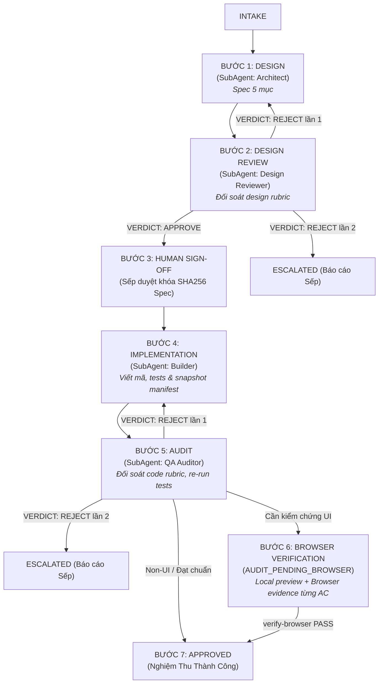
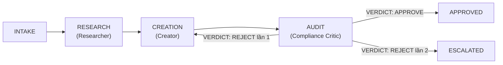

# Antigravity-Harness-Hub
> **Bộ Harness Đa Nhiệm & Phản Biện Tự Hành 2.0**

`Antigravity-Harness-Hub` là khung điều phối (harness framework) tự hành chuẩn hóa quy trình phát triển đa lĩnh vực (Phần mềm & Tiếp thị/Nội dung). Hệ thống kết hợp cơ chế phân vai tác tử chuyên môn hóa, cỗ máy trạng thái (State Machine), và rào chắn kiểm định chất lượng đối nghịch (Adversarial Quality Gate) tích hợp cầu dao ngắt mạch (Circuit Breaker) chống kẹt vòng lặp sau tối đa 2 lượt phản biện.

> ### ⚠️ Ranh giới thực tế giữa 2 tầng (đọc trước khi dùng)
>
> | Tầng | Vai trò thật | Ai chạy |
> | :--- | :--- | :--- |
> | `GEMINI.md` / `AGENTS.md` + `agents/` + `rubrics/` + `plugins/*/skills/` | **Bộ luật vận hành thật** — quy định Quản đốc phân vai, gọi subagent, gọi skill theo slash command | Antigravity 2.0 (đọc trực tiếp trong IDE) |
> | `harness/orchestrator.py` + `harness/runners/` | **Mô phỏng state machine**, không gọi LLM hoặc tự sinh nội dung | CLI không có checkpoint flag (dev/CI) |
> | `harness/app_workflow.py` + `harness/marketing_workflow.py` | **Checkpoint stores thật**: khóa hash/evidence/gates, không chạy agents/browser hoặc publish | CLI `--workflow` / `--marketing-workflow` do native orchestrator gọi |
>
> Muốn agent *viết nội dung thật*, nó phải chạy trong Antigravity theo `GEMINI.md`. Checkpoint không thay thế dispatch native. Human Spec gate là behavior app sản phẩm; không tạo signoff giả hoặc gate mới cho bảo trì harness đã được Sếp giao.

Hướng dẫn: [App local và schema 2](docs/app-workflow-guide.md), [Marketing content/research-only và publishing local](docs/marketing-workflow-guide.md), [Native readiness và portable smoke](docs/native-readiness.md). Antigravity E2E: NOT_VERIFIED cho đến khi có native evidence thật; model/tool metadata không chứng minh availability/sandbox/isolation.


---

## MCP Server cho skill `framework-marketing-da-kenh`

Skill marketing đa kênh truy vấn MCP server của Noti. Cần thêm server vào ứng dụng AI trước khi dùng:

- URL endpoint (JSON-RPC, dán vào phần "thêm MCP server" của ứng dụng): `https://go.noti.vn/cong-cu/framework-marketing-da-kenh/mcp`
- Tên server gợi ý: `noti-framework-marketing` (đã khai trong `plugins/marketing/mcp_config.json`)
- Server cung cấp 8 tool `framework_*`; schema đã kiểm chứng lưu tại `plugins/marketing/skills/framework-marketing-da-kenh/references/mcp-tools-schema.json`
- Chưa cấu hình MCP vẫn dùng được skill ở **chế độ khung tĩnh** (6 pha + nhóm kênh + 6 loại liên kết), nhưng mất phần khối việc chi tiết và link sơ đồ.

## 1. Cấu Trúc Thư Mục Dự Án

```
Antigravity-Harness-Hub/
├── agents/                                 # Đặc tả vai trò và trách nhiệm của từng tác tử
│   ├── app/                                # Tác tử khối Kỹ thuật / Lập trình (App)
│   │   ├── architect.md                    # System Architect (Thiết kế hệ thống & Spec 5 mục)
│   │   ├── design_reviewer.md              # Design Reviewer (Thẩm định độc lập Spec kiến trúc)
│   │   ├── builder.md                      # Developer (Lập trình mã nguồn & unit test)
│   │   └── qa_auditor.md                   # QA Reviewer (Kiểm thử độc lập, bảo mật & browser evidence)
│   ├── marketing/                          # Tác tử khối Tăng trưởng / Nội dung (Marketing)
│   │   ├── web_researcher.md               # Web & Market Intelligence Researcher
│   │   ├── creator.md                      # Content Creator (Soạn kịch bản & copy chuyển đổi cao)
│   │   └── compliance_critic.md            # Policy Reviewer (Rà soát chính sách, lọc AI slop)
│   ├── registry.md                         # Bảng đăng ký định danh & quyền hạn tác tử
│   └── synthesizer.md                      # Tác tử tổng hợp tri thức & giải pháp
├── docs/                                   # Tài liệu hướng dẫn & quy chuẩn vận hành
│   └── app-workflow-guide.md               # Cẩm nang Gemini Native App Workflow & Checkpoint Guide
├── plugins/                                # Skills đóng gói theo plugin (Antigravity đọc trực tiếp)
│   ├── code/skills/                        # 22 skill kỹ thuật (SKILL.md + references/ + scripts/)
│   └── marketing/skills/                   # 12 skill marketing / nội dung
├── .agent/ , .agents/                      # Khai báo search path cho Antigravity (skills.json, plugins.json)
├── .brain/                                 # Dữ liệu runtime (trajectories, learnings) — KHÔNG commit
├── scripts/                                # Tiện ích: session_manager.py, apify_crawler.py, auto_harvest_global.py, dispatch_subagents.py
├── configs/                                # Tệp cấu hình phân tầng model và giới hạn vận hành
│   └── harness_config.json                 # Model tier, roles, max_rounds, skill_routing (34 skill)
├── harness/                                # Lõi thực thi (Harness Core Engine)
│   ├── app_workflow.py                     # Quản lý vòng đời checkpoint, evidence deduplication & consistency sweep
│   ├── orchestrator.py                     # ChiefOrchestrator: Bộ điều phối trung tâm
│   ├── quality_gate.py                     # AdversarialQualityGate & Verdict logic
│   ├── state_machine.py                    # Cỗ máy trạng thái (HarnessState & TaskContext)
│   ├── memory/                             # Vòng lặp tự học & bộ nhớ trajectory (harvester.py, distiller.py, trajectory.py)
│   ├── skills/                             # Quản lý vòng đời skill, staging, routing (curator.py, manager.py, router.py)
│   └── runners/                            # Các Runner thực thi theo phân nhánh
│       ├── app_runner.py                   # Luồng vận hành nhánh Build App
│       └── marketing_runner.py             # Luồng vận hành nhánh Marketing
├── rubrics/                                # Bộ tiêu chí đánh giá nghiệm thu chuẩn hóa
│   ├── design_review_rubric.md             # Tiêu chuẩn thẩm định thiết kế kiến trúc & Spec 5 mục
│   ├── code_quality_rubric.md              # Tiêu chuẩn chất lượng code, test, OWASP, UI verification
│   └── content_compliance_rubric.md        # Tiêu chuẩn chính sách nền tảng, chống AI slop
├── tests/                                  # Bộ kiểm thử tự động (16 files)
│   ├── test_app_workflow.py                # Checkpoint store, review gate, verify-browser & evidence deduplication
│   ├── test_harness_core.py                # Unit test: State machine, Quality gate, Routing
│   ├── test_harness_e2e.py                 # E2E test: Luồng phản biện 2 vòng, Escalate
│   ├── test_harness_learning.py            # Trajectory + Learning Harvester
│   ├── test_marketing_skills.py            # Frontmatter & loader của skill
│   ├── test_session_manager.py             # Portable session sync
│   ├── test_skill_router.py                # Keyword routing
│   └── test_repo_integrity.py              # Chặn lỗi: thư mục lồng, file rác, secret, path cá nhân, ref gãy
├── setup/                                  # Cài đặt cấu hình môi trường mới
│   ├── config.json                         # Cấu hình Antigravity plugins & userSettings chuẩn
│   └── setup.ps1                           # Merge defaults, hỗ trợ -TargetDirectory/-SkipSessionRestore
├── run_harness.py                          # Giao diện dòng lệnh CLI chính của hệ thống (Task & Workflow checkpoint)
└── README.md                               # Tài liệu hướng dẫn chi tiết
```

### Mô Tả Chi Tiết Các Tệp Tin

| Tệp tin / Thư mục | Trách nhiệm chính |
| :--- | :--- |
| `harness/app_workflow.py` | Quản lý vòng đời Checkpoint cho nhánh App (`WorkflowStore`): kiểm soát chuyển trạng thái, thẩm định chữ ký SHA256 Spec/Manifest, tự động khử trùng lặp bằng chứng (evidence deduplication) và quét sạch trạng thái cũ (consistency auto-sweep). |
| `docs/app-workflow-guide.md` | Hướng dẫn chi tiết luồng vận hành chuẩn Native Gemini App Workflow: hợp đồng vai trò, tiêu chuẩn nghiệm thu và quy trình tái tục nhiệm vụ (resume). |
| `harness/state_machine.py` | Định nghĩa các trạng thái (`INIT`, `INTAKE`, `DESIGN`, `IMPLEMENTATION`, `AUDIT`, `APPROVED`, `REJECTED`, `ESCALATED`) và quản lý bước chuyển trạng thái hợp lệ, ngăn chặn việc nhảy cóc quy trình. |
| `harness/quality_gate.py` | Kiểm tra định dạng phán quyết của Checker (`VERDICT: APPROVE`, `REJECT`, `ESCALATE`) và đếm số vòng lặp critique. |
| `harness/orchestrator.py` | Khởi tạo môi trường, tiếp nhận yêu cầu từ người dùng, nạp `TaskContext`, chuyển giao cho Runner thích hợp và gửi kết quả thẩm định. |
| `harness/runners/` | Đóng gói chu trình 3 bước cho từng nhánh: `app_runner.py` (Architect → Builder → QA Auditor) và `marketing_runner.py` (Researcher → Creator → Compliance Critic). Runner là nơi ghi trace từng bước. |
| `harness/memory/` | Vòng lặp tự học & bộ nhớ quỹ đạo (Trajectory): thu hoạch bài học kinh nghiệm (`harvester.py`), chưng cất kỹ năng mới (`distiller.py`) và lưu trữ lịch sử thực thi (`trajectory.py`). |
| `harness/skills/` | Quản lý vòng đời kỹ năng: định tuyến theo từ khóa (`router.py`), quản lý hàng đợi staging và phê duyệt (`manager.py`), đánh giá chất lượng và phát hiện trùng lặp (`curator.py`). |
| `configs/harness_config.json` | Khai báo model tier (`pro`/`flash`), `roles`, `limits` và `skill_routing` (34 skill → keyword). **Lưu ý:** chưa có code nào resolve/gọi model — đây là metadata cấu hình, cần adapter LLM mới dùng được. |
| `rubrics/` | Định nghĩa các checklist khắt khe độc lập mà Checker bắt buộc phải đối chiếu khi đánh giá (`design_review_rubric.md`, `code_quality_rubric.md`, `content_compliance_rubric.md`). |

---

## 2. Luồng Điều Phối Theo Phân Nhánh

Hệ thống hoạt động theo nguyên tắc tách biệt vai trò (Maker-Checker Invariant): Tác tử tạo nội dung/code không bao giờ tự duyệt sản phẩm của mình.

### 2.1. Nhánh 1: Phát Triển Phần Mềm (`app`) — Gemini Native App Workflow

Quy trình phát triển phần mềm tuân thủ nghiêm ngặt mô hình Gemini Native App Workflow 7 bước với cơ chế Maker-Checker 2 tầng (Kiến trúc & Mã nguồn):



1. **Bước 1 - DESIGN (Architect):**
   - **Tác tử:** `agents/app/architect.md` (System Architect).
   - **Nhiệm vụ:** Tiếp nhận yêu cầu nghiệp vụ, phân tích ranh giới chức năng (blast radius), thiết kế kiến trúc phân lớp, Schema dữ liệu, hợp đồng API và danh sách Acceptance Criteria có ID rõ ràng. Không được trực tiếp sửa đổi source code.
2. **Bước 2 - DESIGN REVIEW (Design Reviewer độc lập):**
   - **Tác tử:** `agents/app/design_reviewer.md` (Design Reviewer).
   - **Nhiệm vụ:** Thẩm định độc lập bản Spec đối chiếu với `rubrics/design_review_rubric.md`. Kiểm tra tính khả thi, độ hoàn thiện của AC, rủi ro bảo mật và hiệu năng. Phán quyết chuẩn `VERDICT: APPROVE` hoặc `VERDICT: REJECT`.
3. **Bước 3 - HUMAN SIGN-OFF (Phê duyệt của Sếp):**
   - **Thao tác:** Khóa cố định mã băm `spec_sha256`. Chỉ khi Sếp xác nhận rõ ràng, hệ thống mới ghi nhận sign-off và cho phép chuyển sang bước triển khai. Mọi sửa đổi vào Spec sau sign-off sẽ tự động vô hiệu hóa phê duyệt cũ.
4. **Bước 4 - IMPLEMENTATION (Builder):**
   - **Tác tử:** `agents/app/builder.md` (Developer / Maker).
   - **Nhiệm vụ:** Viết mã nguồn phân lập và kiểm thử tương ứng bám sát Spec đã khóa; ghi nhận snapshot bytes toàn bộ source/test/config vào manifest SHA256. Phải chạy tests xanh trước khi bàn giao.
5. **Bước 5 - AUDIT (QA Auditor độc lập):**
   - **Tác tử:** `agents/app/qa_auditor.md` (QA Reviewer / Checker).
   - **Nhiệm vụ:** Đối soát mã nguồn với `rubrics/code_quality_rubric.md`, xác minh `spec_sha256` và `manifest_sha256`, tự mình chạy lại toàn bộ test suite. Nếu là ứng dụng Web/UI cần bằng chứng trực quan, chuyển trạng thái sang `AUDIT_PENDING_BROWSER`.
6. **Bước 6 - BROWSER VERIFICATION (Kiểm chứng giao diện thực tế):**
   - **Thao tác:** QA Auditor khởi chạy local preview, tương tác browser thực tế qua DevTools MCP, thu thập ảnh chụp màn hình/console log chứng minh từng UI AC. Gọi lệnh `verify-browser` để tự động khử trùng lặp evidence và kích hoạt cơ chế Consistency Auto-Sweep dọn sạch toàn bộ trạng thái cũ.
7. **Bước 7 - APPROVED (Nghiệm thu):**
   - Nhiệm vụ hoàn thành với đầy đủ bằng chứng thực chứng, checkpoint nhất quán và bàn giao báo cáo minh bạch cho Sếp.

---

### 2.2. Nhánh 2: Sáng Tạo Nội Dung & Tiếp Thị (`marketing`)



1. **Bước 1 - RESEARCH (Researcher):**
   - **Tác tử:** `agents/marketing/web_researcher.md` (Web & Market Intelligence Researcher).
   - **Nhiệm vụ:** Nghiên cứu insight khách hàng mục tiêu, tìm kiếm từ khóa ngách, nắm bắt xu hướng thị trường và giải phẫu đối thủ cạnh tranh.
2. **Bước 2 - CREATION (Creator):**
   - **Tác tử:** `agents/marketing/creator.md` (Content Creator).
   - **Nhiệm vụ:** Soạn thảo kịch bản video, bài viết mạng xã hội hoặc sales copy chuyển đổi cao dựa trên insight từ Researcher.
3. **Bước 3 - AUDIT (Compliance Critic):**
   - **Tác tử:** `agents/marketing/compliance_critic.md` (Policy Reviewer).
   - **Nhiệm vụ:** Thẩm định nội dung đối soát với `rubrics/content_compliance_rubric.md`. Rà soát vi phạm chính sách nền tảng (Facebook Community Standards, YouTube Trust & Safety, TikTok Policy), loại bỏ sáo rỗng AI (AI slop) và ngụy biện logic.

Mode `research-only` bỏ CREATION, vẫn independent Critic audit. Bốn required IDs source_accuracy/policy/integrity/task_quality và đủ claim IDs được hash-bound; analytical task kiểm số liệu/công thức/tiền tệ/dates/source quality thay Hook/CTA bắt buộc. Hướng dẫn payload trong docs/marketing-workflow-guide.md.

### 2.3. Gọi Trực Tiếp Kỹ Năng Nhánh Marketing Trong Ô Chat (Slash Commands)

Toàn bộ 12 kỹ năng của nhánh Marketing đã được tích hợp đầy đủ và có thể gọi trực tiếp trong ô chat Antigravity bằng lệnh Slash `/<tên_lệnh>`:

| Lệnh Slash trong Chat | Kỹ Năng | Trọng Tâm Xử Lý |
| :--- | :--- | :--- |
| `/boc-phot-storytelling` | Kịch bản Bóc Phốt Tài Chính | Soạn và chỉnh kịch bản theo 6 format kể chuyện đỉnh cao |
| `/check-youtube-policy` | YouTube Policy Auditor | Rà soát vi phạm 50 cụm chính sách YouTube & viết lại Safe Script |
| `/yt-competitor-analyzer` | YouTube Competitor Analyzer | Quét toàn bộ video đối thủ từ URL, xuất Dashboard HTML & CSV |
| `/alex-hormozi-offer-builder` | Grand Slam Offer Builder | Thiết kế Offer không thể chối từ theo framework $100M Offers |
| `/alex-hormozi-money-models` | $100M Money Models | Xây dựng chuỗi thang sản phẩm, upsell, downsell & mô hình dòng tiền |
| `/kahneman-creative-ads` | Kahneman Creative Strategy | Lập Canvas chiến lược sáng tạo quảng cáo dựa trên cơ chế nhận thức |
| `/traffic-secrets-playbook` | Traffic Secrets Playbook | Kế hoạch kéo và tối ưu traffic 14 bước của Russell Brunson |
| `/cong-thuc-viet-content-by-noti-v4` | 14 Công Thức Content Noti | Viết content/copy ads chuyển đổi cao theo 14 công thức tâm lý + NLP |
| `/viet-content-seo-geo-v5` | Content Chuẩn SEO + AEO + GEO | Tối ưu bài viết đạt chuẩn SEO, trích dẫn AEO/GEO cho AI Search |
| `/meta-ads-analyzer-mod-by-noti` | Meta Ads Analyzer Mod Noti | Chẩn đoán chuyên sâu hiệu suất quảng cáo Meta, CPA/ROAS/CPM |
| `/fb-admin` | Facebook Fanpage Manager | Quản lý Fanpage (đăng bài, đọc/trả lời comment) |
| `/framework-marketing-da-kenh` | Framework Marketing Đa Kênh | Sơ đồ hoá hành trình khách hàng 6 pha, kết nối ma trận kênh & 8 công cụ MCP Noti |

---

## 3. Cơ Chế Phản Biện Độc Lập & Cầu Dao Ngắt Mạch (Circuit Breaker)

### 3.1. Rào Chắn Kiểm Định Độc Lập (Adversarial Quality Gate)
- Checker (`qa_auditor` hoặc `compliance_critic`) hoạt động hoàn toàn khách quan theo chuẩn đóng.
- Phán quyết bắt buộc phải chứa một trong các nhãn định dạng chuẩn:
  - `VERDICT: APPROVE`: Công việc đạt chuẩn toàn bộ rubric.
  - `VERDICT: REJECT`: Công việc có lỗi, thiếu sót hoặc vi phạm chính sách.
  - `VERDICT: ESCALATE` (hoặc `ESCALATE_HUMAN`): Phát hiện lỗi hệ thống, bế tắc hoặc vi phạm nghiêm trọng cần con người can thiệp.

### 3.2. Cầu Dao Ngắt Mạch Sau 2 Vòng Phản Biện (Stagnation Breaker)
Để ngăn ngừa tình trạng tác tử sửa đổi luẩn quẩn, gây cháy token và suy thoái ngữ cảnh:
- Khi Checker đưa ra `VERDICT: REJECT`, biến đếm `critique_rounds` của task được tăng thêm 1 đơn vị.
- REJECT lần đầu: Task quay Maker của pha để sửa theo phản hồi.
- REJECT thứ hai trong cùng pha: lập tức ESCALATED; app counters design/code riêng, marketing audit counter tồn tại qua restart/resubmit/revise.
- Khi đã ở trạng thái `ESCALATED`, hệ thống dừng lặp lại và bàn giao cho chuyên gia con người xử lý.

---

## 4. Hướng Dẫn Sử Dụng & Kiểm Thử

### 4.1. Cài Đặt Cấu Hình Môi Trường Khi Sang Máy Mới

Để áp dụng toàn bộ cấu hình plugin (`anti-workflows`, `chrome-devtools-plugin`, `gemini-api`, `google-antigravity-sdk`, `modern-web-guidance-plugin`) và `userSettings` chuẩn của hệ thống:

```powershell
powershell -NoProfile -ExecutionPolicy Bypass -File setup\setup.ps1 -TargetDirectory .brain\portable-smoke -SkipSessionRestore
```
Script cài vào đích portable chỉ định, sao lưu/merge defaults và giữ lựa chọn config user; không restore global sessions khi có TargetDirectory. Bỏ TargetDirectory chỉ khi muốn cài user global `%USERPROFILE%\.gemini\config`.

---

### 4.2. Chạy Kiểm Thử Tự Động (Automated Testing)

Toàn bộ logic máy trạng thái, routing, vòng đời checkpoint workflow và kịch bản ngắt mạch đã được bao phủ bởi pytest. Để thực thi toàn bộ test suite:

```bash
# Chạy toàn bộ unit test và e2e test
pytest -v
```

Xem logs QA thực tế cho current revision. Archive không có `.git` khiến `test_env_example_duoc_commit` không chứng minh tracked state; giữ nguyên test và báo giới hạn, không tạo Git giả hoặc claim toàn bộ PASS.

Bộ test gồm 16 file:
- `test_app_workflow.py` — Checkpoint store, review gate, verify-browser & evidence deduplication
- `test_auto_harvest_global.py` — Harvest global learnings & trajectories
- `test_curator.py` — Đánh giá vòng đời skill, phát hiện trùng lặp & curation
- `test_distiller.py` — Chưng cất trajectory thành kỹ năng mới
- `test_dsh_patterns.py` — Kiểm tra mẫu thiết kế & phân rã nhiệm vụ (DSH)
- `test_harness_core.py` — State machine, quality gate, circuit breaker
- `test_harness_e2e.py` — Luồng 2 nhánh, escalate sau 2 vòng REJECT
- `test_harness_learning.py` — Trajectory store + learning harvester
- `test_harness_live.py` — Kiểm thử live harness orchestration
- `test_marketing_skill_quality.py` — Kiểm định chất lượng nội dung skill marketing
- `test_marketing_skills.py` — Frontmatter & loader của skill marketing
- `test_repo_integrity.py` — Chặn hồi quy cấu trúc/secret/path cá nhân/ref gãy
- `test_score_scripts.py` — Đối soát script chấm điểm SEO (Python vs Node.js)
- `test_session_manager.py` — Portable session sync
- `test_skill_manager.py` — Quản lý vòng đời skill và hàng đợi staging
- `test_skill_router.py` — Keyword routing (34 skill)

```text
$ pytest -q
187 passed, 1 skipped
```

---

### 4.3. Hướng Dẫn Sử Dụng Lệnh CLI (`run_harness.py`)

Hệ thống cung cấp điểm vào CLI chuẩn xác qua `run_harness.py` hỗ trợ 2 chế độ: mô phỏng nhanh trạng thái nhiệm vụ và quản lý checkpoint vòng đời Native App Workflow.

#### 4.3.1. Chế Độ Mô Phỏng Nhiệm Vụ Nhanh (`--task`)

```bash
python run_harness.py --task "<mô tả nhiệm vụ>" --branch {app,marketing,auto}
```

**Ví dụ thực thi:**
```bash
# Khởi chạy luồng Kỹ thuật (App)
python run_harness.py --task "Xây dựng module xác thực phân quyền JWT" --branch app

# Khởi chạy luồng Tiếp thị (Marketing)
python run_harness.py --task "Soạn kịch bản video TikTok 60 giây phân tích tài chính" --branch marketing
```

**Tham số dòng lệnh nhiệm vụ:**
- `--task`: Mô tả nhiệm vụ.
- `--branch {app,marketing,auto}`: Chọn nhánh (mặc định `auto` = tự định tuyến theo `skill_routing`).
- `--checker-output "VERDICT: ..."`: Phán quyết Checker đưa vào (mặc định `VERDICT: APPROVE`). Dùng để kiểm thử luồng REJECT/ESCALATE.
- `--review-rounds N`: Mô phỏng N vòng review. Kích hoạt circuit breaker khi REJECT đến vòng 3 (`--review-rounds 3 --checker-output "VERDICT: REJECT"` → ESCALATED).
- `--task-id`: ID tùy chọn (mặc định sinh UUID mới).
- `--dump-skill`: In nội dung SKILL.md đã nạp ra stdout.
- `--json`: Xuất kết quả dạng JSON.
- `--auto-distill`: Tự động chưng cất kỹ năng vào staging khi task APPROVE.
- `--distill <TASK_ID>`: Chưng cất kỹ năng từ trajectory đã lưu.
- `--curate`: Đánh giá vòng đời kỹ năng và phát hiện trùng lặp.
- `--skills-pending`, `--skills-approve <ID>`, `--skills-reject <ID>`: Quản lý hàng đợi Staging.

#### 4.3.2. Quản Lý Vòng Đời Native App Workflow Checkpoint (`--workflow`)

Điểm vào chuyên biệt quản lý và đối soát tiến trình phát triển ứng dụng thông qua máy trạng thái checkpoint (`harness/app_workflow.py`):

```bash
python run_harness.py --workflow <action> --task-id <TASK_ID> [--actor <ACTOR>] [--payload <JSON>] [--payload-file <PATH>]
```

**Các hành động `--workflow` được hỗ trợ:**
| Hành động (`--workflow`) | Giai đoạn áp dụng | Mô tả & Chức năng |
| :--- | :--- | :--- |
| `init` | Khởi tạo | Tạo checkpoint mới cho task ID với các thông tin scope ban đầu. |
| `status` | Bất kỳ | Đọc và hiển thị toàn bộ trạng thái hiện tại, lịch sử revision và kết quả audit của task. |
| `spec` | `INIT` / Sửa đổi | Architect nạp bản thiết kế Spec 5 mục, sinh mã băm `spec_sha256`. |
| `design-review` | `DESIGN` | Design Reviewer độc lập ghi nhận phán quyết (`APPROVE` / `REJECT`). |
| `sign-off` | `DESIGN` | Sếp (Human) phê duyệt Spec, khóa cứng `spec_sha256` trước khi viết mã. |
| `implementation` | `DESIGN` | Builder bàn giao mã nguồn kèm `manifest_sha256` và kết quả kiểm thử. |
| `audit` | `IMPLEMENTATION` | QA Auditor độc lập đối soát mã nguồn và kiểm thử. |
| `audit-pending-browser` | `AUDIT` | QA Auditor tạm dừng thẩm định mã để chờ kiểm chứng giao diện thực tế. |
| `verify-browser` | `AUDIT_PENDING_BROWSER` | QA Auditor nạp bằng chứng UI thực tế (DevTools MCP), tự động khử trùng lặp evidence và kích hoạt Consistency Auto-Sweep để hoàn tất nghiệm thu (`APPROVED`). |
| `revise` | `AUDIT` (khi REJECT) | Ghi nhận yêu cầu chỉnh sửa và chuyển ngược task về cho Builder. |

**Ví dụ quy trình checkpoint thực tế:**
```bash
# 1. Khởi tạo task
python run_harness.py --workflow init --task-id task-board-01 --actor "User" --payload '{"title": "Task Board App"}'

# 2. Architect nạp Spec
python run_harness.py --workflow spec --task-id task-board-01 --actor "Architect" --payload-file spec.json

# 3. Design Reviewer thẩm định
python run_harness.py --workflow design-review --task-id task-board-01 --actor "Design Reviewer" --payload '{"verdict": "APPROVE", "notes": "Spec đạt chuẩn 5 mục"}'

# 4. Sếp duyệt khóa Spec
python run_harness.py --workflow sign-off --task-id task-board-01 --actor "User" --payload '{"approved": true}'

# 5. Builder bàn giao source code
python run_harness.py --workflow implementation --task-id task-board-01 --actor "Builder" --payload-file implementation.json

# 6. QA Auditor kiểm chứng giao diện thực tế & hoàn tất phê duyệt
python run_harness.py --workflow verify-browser --task-id task-board-01 --actor "QA Auditor" --payload-file browser_evidence.json

# 7. Kiểm tra trạng thái cuối
python run_harness.py --workflow status --task-id task-board-01
```

---

## 5. Bảo Mật & Vận Hành An Toàn

- **Không hardcode secret.** Page token / API key chỉ đọc từ biến môi trường hoặc `.env` (đã gitignore). Mẫu: `.env.example`.
- **⚠️ Cảnh báo lịch sử:** repo từng commit **Page Access Token Facebook thật** (`fb-admin/scripts/fb_api.py`) và **YouTube API key** (`yt-competitor-analyzer/scripts/analyze.js`) ở nhiều commit trước bản vá. Nếu các token đó từng được dùng: **thu hồi và cấp lại token mới** (Meta Business Suite / Google Cloud Console). Xoá file ở HEAD **không** xoá secret khỏi lịch sử git.
- Script cần cấu hình: `fb-admin` → `FB_PAGE_ID` + `FB_PAGE_ACCESS_TOKEN`; `yt-competitor-analyzer` → `YOUTUBE_API_KEY`; `scripts/apify_crawler.py` → `APIFY_API_TOKEN`.
- Trước khi bật `setup/config.json` cho agent: rà lại `globalPermissionGrants` (bản mặc định cấp quyền rộng: `command(*)`, `write_file(*)`, `mcp(*)`, `escalate_admin(...)`) và `enableTerminalSandbox: false`. Chỉ cấp quyền tối thiểu cần dùng.
- Scrape dữ liệu mạng xã hội phải tuân thủ điều khoản nền tảng và quy định về dữ liệu cá nhân.

---

## 6. Ghi Chú Trạng Thái (đã kiểm chứng, không phải suy đoán)

- `harness/*.py` là **mô phỏng state machine**: không gọi LLM API. Circuit breaker chỉ hoạt động khi vòng lặp review được gọi qua `submit_for_review`; một lần chạy CLI đơn lẻ không lặp nên không thể escalate.
- `harness/app_workflow.py` đóng vai trò là **lớp quản lý checkpoint và kiểm chứng trạng thái độc lập** (`WorkflowStore`), bảo vệ tính toàn vẹn của mã băm SHA256 (Spec & Manifest), kiểm soát chặt chẽ thẩm quyền Actor và tự động dọn sạch trạng thái mâu thuẫn (Consistency Auto-Sweep). Nó không gọi trực tiếp LLM API hay chạy browser; việc tương tác LLM và kiểm thử trình duyệt do runtime tác tử native của Gemini trong Antigravity thực thi.
- File phụ trợ và tham chiếu cũ:
  - `plugins/code/skills/app`: Toàn bộ các tham chiếu phụ trợ cũ (`AI_CODE_WORKFLOW.md`, `references/coding-taste.md`, `references/engineering-standards.md`, `templates/app-spec.md`) đã được dọn sạch hoàn toàn, chuyển đổi 100% sang mô hình Native Multi-Agent Orchestration (Architect -> Design Reviewer -> Builder -> QA Auditor).
  - `plugins/marketing/skills/viet-content-seo-geo-v5`: `scripts/score.mjs`, `scripts/score.py` — nay **đã có** trong repo, đã kiểm chứng parity (JSON trùng nhau trên nhiều bài thử).
  Mỗi SKILL.md tương ứng đã có ghi chú **TRẠNG THÁI SKILL**; `tests/test_repo_integrity.py` giữ danh sách trong `KNOWN_GAPS` để không phát sinh con trỏ gãy mới.
- `setup.ps1` hỗ trợ đích portable, merges defaults giữ config user, kiểm resolved paths/symlink/junction và cấm repo/ancestor hoặc đích nằm trong packaged source dirs trước cleanup; repeat copy không tạo nesting. Không chạy default global install trong tests.
- `configs/harness_config.json` khai báo model `Gemini 3.1 Pro` / `Gemini 3.8 Flash` — **chưa xác minh** 2 ID này tồn tại, và không code nào resolve chúng. Cần Sếp xác nhận hoặc thay bằng ID thật khi viết adapter LLM.
