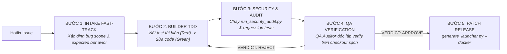

# Gemini native app workflow

Antigravity gọi tác tử thật; CLI chỉ lưu/kiểm checkpoint/hash, không gọi LLM, chạy test hay browser. Simulation không có `--workflow` không chứng minh app đạt. Các gate này áp dụng app native; bảo trì harness đã được Sếp giao không tạo thêm product task hoặc human signoff giả.

## Quy trình Phát triển Toàn diện (End-to-End App Development Workflow)

Toàn bộ quy trình phát triển ứng dụng tuân thủ nghiêm ngặt các pha tuần tự:

| Pha | Tên pha | Tác tử / Vai trò | Nhiệm vụ chính & Tiêu chí nghiệm thu |
| :--- | :--- | :--- | :--- |
| **Pha 0** | **INTAKE** | Quản đốc (Orchestrator) | Phỏng vấn làm rõ 3 tham số cốt lõi (Tech Stack, Lưu trữ dữ liệu, Top 3-5 User Stories) theo `docs/intake-protocol.md`. Cấm tự tiện code bừa bãi khi chưa chốt ý định. |
| **Pha 1** | **DESIGN** | System Architect (`agents/app/architect.md`) | Lập Spec 5 mục (scope, design, contracts, acceptance criteria, risks). **Bắt buộc có tiêu chí AC-SEED (seed data) và AC-HEALTH (endpoint /health kiểm tra uptime/version/status)**. |
| **Pha 2** | **DESIGN_REVIEW** | Design Reviewer (`agents/app/design_reviewer.md`) | Thẩm định độc lập theo `rubrics/design_review_rubric.md`. Phán quyết APPROVE / REJECT gắn Spec SHA256. |
| **Pha 3** | **SIGN_OFF** | Sếp (Human Gate) | Trình đúng Spec SHA256 đã duyệt cho Sếp. Nhận lệnh phê duyệt rõ ràng ("Duyệt", "Bắt đầu code đi"). |
| **Pha 3.5** | **UI_CONCEPT** | Quản đốc (Orchestrator) & Sếp | Áp dụng cho ứng dụng UI (bypass với Non-UI/CLI). Quản đốc sinh 2–4 ảnh concept bằng `generate_image`, trình chiếu cho Sếp và chốt style qua `ask_question`. Lưu visual guideline vào Spec cho Builder. |
| **Pha 4** | **IMPLEMENTATION** | Developer / Builder (`agents/app/builder.md`) | Lập trình theo TDD & Karpathy, **bám sát concept UI đã chốt**, **bắt buộc tạo file seed data (mockData.json hoặc seed script) và endpoint /health**, cấm app trắng trơn. Chạy test/build và local preview. |
| **Pha 4.5** | **CRITIQUE** | Code Critic (`agents/app/code_critic.md`) | Soi Spec GAP, boundary conditions, anti-patterns, dirty mocks theo `rubrics/code_critique_rubric.md`. REJECT trả Builder sửa lại trước khi chuyển sang QA. |
| **Pha 5** | **AUDIT & E2E** | QA Auditor (`agents/app/qa_auditor.md`), E2E Engineer & Critic | Kiểm thử unit/integration độc lập; E2E Playwright POM Desktop/Mobile; giám sát dev server qua `scripts/run_dev_logger.py` (port check & HTTP health check); bàn giao bảng UAT `docs/human-test-sheet-template.md`. |
| **Pha 5.5** | **SECURITY_AUDIT** | Security Auditor (`scripts/run_security_audit.py`) | Quét an toàn bảo mật tự động: Zero hardcoded secrets, Zero critical dependencies vulnerabilities. Bắt buộc vượt qua trước khi release/đóng gói. |
| **Pha 6** | **PACKAGING & OPS** | Packaging Script (`scripts/generate_launcher.py`) | Tự động sinh launcher 1-click `start-app.bat`, tài liệu `HDSD-NHANH.md`, cùng cấu hình production: `Dockerfile` multi-stage (non-root), `docker-compose.yml`, `.github/workflows/ci.yml`, `.env.example`, và `ARCHITECTURE.md`. |

## Smoke local trong Antigravity

1. Cài Python dependencies bằng `py -3.12 -m pip install -r requirements.txt`. Mở workspace harness trong Antigravity, kiểm tool inventory và ghi OBSERVED/DECLARED/UNAVAILABLE/NOT_VERIFIED theo `docs/native-readiness.md`.
2. Pha 0 INTAKE: Phỏng vấn làm rõ 3 tham số cốt lõi (Tech Stack, Lưu trữ, MVP Stories) theo `docs/intake-protocol.md`. Chỉ khi Sếp xác nhận mới chuyển sang Architect.
3. Gửi brief có project directory riêng: “/app Xây Task Board local, thêm/sửa/xóa, title bắt buộc, todo/doing/done, filter, lưu localStorage, desktop/mobile. Dùng Architect → Design Reviewer → trình anh duyệt đúng Spec → Builder → Code Critic → QA test và browser thật. Không deploy.” Đây là benchmark tùy chọn, chưa phải app được triển khai.
4. Gemini quản lý checkpoint/artifacts, gọi Architect và Reviewer độc lập. Spec bắt buộc có AC-SEED dữ liệu mẫu và AC-HEALTH endpoint kiểm tra trạng thái. Sếp đọc Spec và chỉ duyệt đúng bản đã review; Gemini giữ nguyên raw human_message/spec_sha256, không giả approval.
5. Nếu ứng dụng có UI: Kích hoạt Pha 3.5 (UI_CONCEPT). Quản đốc dùng `generate_image` tạo 2–4 ảnh concept với phong cách khác nhau, trình chiếu và dùng `ask_question` để Sếp chọn phong cách. Lưu visual guideline vào Spec trước khi code.
6. Builder sửa đúng Spec trong checkout thật, bám sát visual guideline đã duyệt, bắt buộc tạo mockData/seed script, triển khai /health, chạy test/build và preview. Code Critic soi GAP/logic. QA nhận cùng checkout, tự rerun commands và kiểm từng AC qua browser. Bàn giao URL còn chạy, evidence, defects/limitations. Thiếu browser giữ NOT_VERIFIED; không suy từ trang đầu rằng luồng chính đã đúng.
7. Chạy E2E Playwright, giám sát dev server qua `scripts/run_dev_logger.py` (pre-flight port check & HTTP health check), xuất bảng UAT `docs/human-test-sheet-template.md`.
8. Chạy Pha 5.5 Security Audit qua `scripts/run_security_audit.py --fail-on-critical` đảm bảo Zero Secrets & Zero Critical Vulnerabilities.
9. Đóng gói launcher 1-click và bộ cấu hình Production qua `scripts/generate_launcher.py --docker`.
10. Resume cùng task ID bằng status; route stage/next_agent trước keyword. REJECT đầu trả Maker, REJECT thứ hai cùng pha design/critique/audit ESCALATED ngay (Decoupled Circuit Breakers: critic_rounds <= 2, qa_rounds <= 2, total_cycles <= 3). Counters tồn tại qua replacement/restart/revise.

## CLI

Chạy từ harness checkout. `--project-root` phải là app directory thật; payload là JSON file do agent tạo. Các lệnh dưới là recipes cho runtime, không tự chứng minh có subagent hoặc UI execution.

```powershell
py -3.12 run_harness.py --workflow init --task-id app-smoke --project-root ./app-smoke --task "Local app smoke" --json
py -3.12 run_harness.py --workflow status --task-id app-smoke --json
py -3.12 run_harness.py --workflow spec --task-id app-smoke --actor architect-1 --payload .brain/artifacts/app-smoke/spec.json --json
py -3.12 run_harness.py --workflow design-review --task-id app-smoke --actor reviewer-1 --payload .brain/artifacts/app-smoke/design-review.json --json
py -3.12 run_harness.py --workflow sign-off --task-id app-smoke --payload .brain/artifacts/app-smoke/sign-off.json --json
py -3.12 run_harness.py --workflow implementation --task-id app-smoke --actor builder-1 --payload .brain/artifacts/app-smoke/implementation.json --json
py -3.12 run_harness.py --workflow audit --task-id app-smoke --actor qa-1 --payload .brain/artifacts/app-smoke/audit.json --json
```

Architect/Reviewer/QA không sửa source. Frontmatter tool permissions chỉ DECLARED; file-write không tự cấp terminal/browser hoặc enforced sandbox. Runtime phải tạo context độc lập; actor IDs là provenance tự khai báo.

## Pha 3.5: Thiết kế & Lựa chọn Concept Giao diện (UI_CONCEPT)

Pha 3.5 được kích hoạt ngay sau khi Sếp đã ký duyệt Spec ở Pha 3 (SIGN_OFF). Pha này áp dụng bắt buộc cho tất cả các dự án có giao diện người dùng (Web Frontend, Dashboard, Desktop UI, Mobile UI). Đối với các dự án thuần backend, thư viện, hoặc CLI tool không có UI, pha này sẽ được tự động bỏ qua (bypass) để chuyển thẳng sang Pha 4.

### 1. Mục tiêu
- Loại bỏ hoàn toàn tình trạng "code xong mới thấy giao diện xấu hoặc không đúng gu của Sếp".
- Trực quan hóa cấu trúc layout, phân cấp thông tin, phối màu và thẩm mỹ trước khi Builder viết một dòng code CSS/HTML nào.
- Tạo visual guideline rõ ràng, ràng buộc trách nhiệm thẩm mỹ cho Builder.

### 2. Tạo 2–4 ảnh Concept bằng công cụ `generate_image`
Quản đốc sử dụng công cụ `generate_image` để tạo từ 2 đến 4 concept thiết kế với các phong cách trực quan khác nhau:
- **Phong cách 1 (Apple-inspired / Minimal Clean):** Tinh gọn, bo góc mềm mại, typography thanh lịch (SF Pro / Inter), khoảng trắng thoáng đãng, hiệu ứng kính mờ (frosted glass) tinh tế.
- **Phong cách 2 (Data-Dense Dashboard / Linear-style):** Tối ưu mật độ dữ liệu, đường viền sắc nét, tương phản cao, phím tắt, giao diện làm việc chuyên nghiệp phong cách Linear / Raycast.
- **Phong cách 3 (Modern SaaS / Vibrant Accent):** Tone màu năng động, card nổi bật, visual hierarchy rõ nét, thân thiện với người dùng cuối.
- **Phong cách 4 (Dark Mode / Sleek Futuristic):** Chế độ tối cao cấp, điểm nhấn neon/accent tinh tế, giảm mỏi mắt cho người dùng chuyên sâu.

**Template Prompt tạo ảnh qua `generate_image`:**
```text
Clean modern UI mockup of a [Tên loại ứng dụng, ví dụ: Personal Task Board / Expense Tracker web app].
Key screens and elements: [Liệt kê các thành phần chính theo Spec, ví dụ: sidebar navigation, Kanban columns todo/doing/done, clean task cards with priority badges, top search bar, stat summary].
Style & Aesthetic: [Apple-inspired minimalist / Linear data-dense / Modern SaaS], [light mode / dark mode], subtle borders, clean typography, refined color accents [ví dụ: primary blue #2563EB or purple #7C3AED], no device bezels, professional UI design shot, high resolution, desktop interface viewport.
```

### 3. Trình chiếu ảnh cho Sếp & Khảo sát qua `ask_question`
- Sau khi ảnh được tạo trong thư mục Artifacts, Quản đốc trình chiếu các ảnh concept cho Sếp xem trực tiếp bằng cú pháp Markdown hoặc `carousel`:
  ```markdown
  
  
  ```
- Kích hoạt modal lựa chọn bằng công cụ `ask_question`:
  - Câu hỏi: *"Sếp muốn chọn phong cách concept giao diện nào cho ứng dụng [Tên App]?"*
  - Các lựa chọn cụ thể đại diện cho từng ảnh concept kèm mô tả ngắn về ưu điểm / tone màu.
  - Sếp có thể bấm chọn ngay hoặc nhập phản hồi điều chỉnh (ví dụ: *"Chọn Concept 1 nhưng đổi tone màu xanh lá thành xanh dương"*).

### 4. Bàn giao Visual Guideline cho Builder
- Sau khi Sếp chốt phương án, Quản đốc cập nhật đường dẫn ảnh concept và ghi chú thiết kế vào Spec (`visual_guideline` / Design Memory).
- Khi bàn giao cho Builder tại Pha 4:
  - Cung cấp đường dẫn tuyệt đối của ảnh concept đã chốt.
  - Yêu cầu Builder triển khai cấu trúc layout, bảng màu Tailwind/CSS, font chữ và component states trung thực với ảnh concept.

## Spec và payload

Spec năm mục `scope/design/contracts/acceptance_criteria/risks`; scope/design/contracts/risks là nonempty strings. AC có id/description/ui, `applicable` default true; false cần `na_reason`. **Bắt buộc có ít nhất 1 Acceptance Criteria về dữ liệu mẫu (AC-SEED)** cung cấp sẵn dữ liệu mẫu thực tế, phong phú để demo ngay khi khởi động. **Bắt buộc có tiêu chí kiểm tra trạng thái sức khỏe (AC-HEALTH)** cung cấp endpoint `/health` trả về trạng thái, uptime và version phục vụ monitoring/container. Mọi applicable AC kể cả non-UI phải PASS có evidence. N/A chỉ khi Spec đánh dấu false, reason khớp signed na_reason.

Spec mới có yêu cầu test/build phải kê khai `verification_commands`: nonempty list {id,command,cwd,ac_ids}, cwd exact root-relative (bao gồm ".") resolve theo project_root. QA commands là {id,command,cwd,ac_ids,exit_code,log}; cwd ABSOLUTE nằm trong project, exit_code integer 0, command và AC IDs khớp Spec. Legacy Spec chưa có command list vẫn phải có command/log hợp lệ và evidence mỗi applicable AC.

Ví dụ schema dưới chỉ minh họa; thay command/AC theo stack thật và paths bằng file evidence đã quan sát, không nộp placeholder:

```json
{"scope":"Python CLI source/tests","design":"Existing parser and pure command handler","contracts":"Invalid input exits nonzero","acceptance_criteria":[{"id":"AC1","description":"Valid and invalid input regression tests pass","ui":false},{"id":"AC-SEED","description":"Seed data file mockData.json provided and loaded successfully on startup","ui":false},{"id":"AC-HEALTH","description":"Health check endpoint /health returns ok status and uptime","ui":false}],"risks":"No external writes","verification_commands":[{"id":"tests","command":"python -m pytest -q","cwd":".","ac_ids":["AC1","AC-SEED","AC-HEALTH"]}],"snapshot_exclusions":["coverage"]}
```

Review {verdict APPROVE|REJECT|ESCALATE,spec_sha256,report TEXT}; design PARTIAL_APPROVE forbidden. Signoff {spec_sha256,human_message raw}. CLI accepts whole phrase Duyệt / Duyệt Spec này / Duyệt bản đặc tả này / SIGN_OFF: approved / Bắt đầu code đi, case-insensitive, trim ngoài, optional prefix Sếp:. Không dấu câu cuối hoặc câu điều kiện; không sửa raw message để hợp grammar.

Implementation {report TEXT}; ghi checkout, diff và test/build/preview evidence. Audit {verdict,spec_sha256,manifest_sha256,report TEXT,commands,preview:{url,checks}}. `report` app là TEXT, không tự đọc path. Hash lấy từ checkpoint hiện tại.

```json
{"verdict":"APPROVE","spec_sha256":"FROM_CURRENT_CHECKPOINT","manifest_sha256":"FROM_CURRENT_CHECKPOINT","report":"QA independently reran commands and checked AC1 and AC-SEED","commands":[{"id":"tests","command":"python -m pytest -q","cwd":"ABSOLUTE_APP_DIRECTORY","ac_ids":["AC1","AC-SEED"],"exit_code":0,"log":"ABSOLUTE_EVIDENCE_FILE"}],"preview":{"checks":[{"id":"AC1","status":"PASS","evidence":"ABSOLUTE_EVIDENCE_FILE"},{"id":"AC-SEED","status":"PASS","evidence":"ABSOLUTE_EVIDENCE_FILE"}]}}
```

`preview.checks` bao gồm mỗi AC đúng một lần cả UI/non-UI. UI applicable cần local URL hợp lệ (localhost/127.0.0.1/::1), PASS evidence. Non-UI không cần URL nhưng vẫn PASS có evidence. Optional `functional/http_smoke/browser` records có status và evidence/log khi PASS, reason khi NOT_VERIFIED. functional_status dựa commands và non-UI checks hợp lệ; explicit functional NOT_VERIFIED không bị tự nâng. HTTP thiếu evidence vẫn NOT_VERIFIED; browser_status theo applicable UI AC, không biến thiếu kiểm thành PASS.

## Partial audit và browser promotion

PARTIAL_APPROVE chỉ hợp lệ khi ít nhất một applicable UI AC NOT_VERIFIED có reason, mọi applicable non-UI PASS và command/log hợp lệ. Store chuyển AUDIT_PENDING_BROWSER, next_agent human_browser_verification. Không dùng audit-pending-browser hoặc verify-browser trực tiếp từ AUDIT để bỏ QA.

```powershell
py -3.12 run_harness.py --workflow audit-pending-browser --task-id app-smoke --actor qa-1 --payload .brain/artifacts/app-smoke/browser-request.json --json
py -3.12 run_harness.py --workflow verify-browser --task-id app-smoke --actor browser-checker-1 --payload .brain/artifacts/app-smoke/browser-result.json --json
```

Browser request {report TEXT}; chỉ sau valid partial audit. Browser result {spec_sha256,manifest_sha256,url,checks:[{id,status:"PASS",evidence:absolute file}]} chỉ có đúng pending UI IDs, không duplicate/extra, URL chính xác như audit. Có thể dùng preview:{url,checks}; screenshots/logs optional lists paths. Promotion kiểm lại cả source, signed review/signoff, old logs/evidence và giữ QA actor hiện hữu; source hoặc old logs đổi phải bị chặn.

## Snapshot, evidence và revision

Manifest bytes gồm mọi source/test/config trong project, staged/unstaged/untracked, .htm, *_files, .log, ORCHESTRATION_/ANTIGRAVITY_ prefixes và nested build/dist. Mặc định chỉ loại exact root .git/.gitnexus/.brain/node_modules/.venv/venv/.pytest_cache/.cache; __pycache__ và .pyc compiled caches loại ở mọi cấp. Generated .next/dist/build/coverage/test-results/playwright-report chỉ loại khi Spec top-level `snapshot_exclusions` kê khai exact root-relative paths, không glob/traversal.

Evidence/log paths ABSOLUTE, không traversal/symlink/junction; nằm trong project, configured brain artifacts hoặc signed top-level `evidence_root` ABSOLUTE directory. Payload JSON path resolve từ cwd CLI; evidence/QA cwd không nhận relative. Lưu logs/evidence ở brain artifacts nằm ngoài manifest để không tự đổi snapshot. Hash attest unchanged bytes, không chứng thực ai chạy test/browser.

QA kiểm cùng checkout thật; git diff main...HEAD bỏ sót staged/unstaged/untracked nên chỉ phụ trợ. status ở AUDIT_PENDING_BROWSER/APPROVED kiểm lại current bindings. Source/evidence đổi làm authority stale. Trong AUDIT, QA có thể REJECT với checkpoint hashes và report, trả Builder nộp implementation mới. Thiết kế đổi dùng revise {reason}; về DESIGN và phải review/signoff lại. Revise/resubmit xóa aggregate/browser requests/verification/approval nhưng giữ counters; ESCALATED không tự reopen.

```powershell
py -3.12 run_harness.py --workflow revise --task-id app-smoke --payload .brain/artifacts/app-smoke/revise.json --json
py -3.12 run_harness.py --workflow migrate-legacy --task-id legacy-app --payload .brain/artifacts/legacy-app/revalidation.json --json
```

Schema 2 hardened. Pristine v1 DESIGN/DESIGN_REVIEW/SIGN_OFF/IMPLEMENTATION tự migration khi không có prior implementation/audit/manifest/browser history, giữ task ID/counters/events/raw signoff và kiểm hash/actors. v1 AUDIT/AUDIT_PENDING_BROWSER/APPROVED fail closed; migrate-legacy {reason} archive old authority trong legacy_revalidation, giữ identity/history/counters/actors, về DESIGN cần review/human signoff/implementation/QA mới. Corrupt state không được đoán sửa; không grandfather approval hoặc tạo task mới để xóa counter.

## Giai đoạn E2E Playwright & UAT

Sau khi hoàn thành Unit/Integration test ở pha AUDIT, các dự án có giao diện người dùng chuyển sang giai đoạn E2E & UAT:
- **E2E Automation (`E2E_Engineer`):** Viết kịch bản Playwright theo chuẩn Page Object Model (POM), kiểm thử responsive trên Desktop (1280x720) và Mobile (390x844), chạy headless/headed, thu thập screenshots và traces cho từng AC.
- **E2E Independent Audit (`E2E_Critic`):** Thẩm định độc lập độ phủ 100% AC, phát hiện flaky tests (chặn sleep mù), kiểm tra screenshots và log console của trình duyệt.
- **Giám sát Dev Server (`scripts/run_dev_logger.py`):** Sử dụng helper script để chạy dev server và tự động bắt lỗi runtime/crash vào `runtime-crash.log`. Tích hợp pre-flight port check và HTTP health check (`wait_for_http_ok`).
- **Bàn giao UAT (Human Test Sheet):** Xuất bảng nghiệm thu người dùng thực tế theo mẫu `docs/human-test-sheet-template.md` để Sếp trực tiếp kiểm tra các luồng nghiệp vụ trên URL local.

## Pha 5.5: Thẩm định An toàn Bảo mật (Security Audit)

Trước khi đóng gói bàn giao, toàn bộ mã nguồn và dependencies bắt buộc phải trải qua cổng kiểm soát an toàn tự động bằng script `scripts/run_security_audit.py`:

```powershell
py -3.12 scripts/run_security_audit.py --app-dir ./app-path --fail-on-critical
```

- **Quét Hardcoded Secrets:** Quét đệ quy toàn bộ file source code/config với các biểu thức chính quy chuẩn xác, phát hiện AWS keys, GitHub tokens, OpenAI/Anthropic/Google API keys, Database URLs kèm password, Private Keys (RSA/EC), JWT tokens. Tự động bỏ qua an toàn các test fixtures và mock data.
- **Quét Dependency Vulnerabilities:** Tự động phát hiện `package.json` (chạy `npm audit`) và `requirements.txt` (chạy `pip-audit`), có cơ chế fallback mượt mà nếu thiếu CLI trên môi trường local.
- **Tiêu chí cổng (Gate):** Bắt buộc **Zero Secrets** và **Zero Critical Vulnerabilities** mới được thông qua sang Pha 6.

## Pha 6: Đóng gói và Sẵn sàng Vận hành Production (Packaging & Ops)

Sau khi AUDIT, E2E và Security Audit đều vượt qua, kích hoạt script `scripts/generate_launcher.py` kèm cờ `--docker` để hoàn thiện bộ tài liệu & hạ tầng vận hành:

```powershell
py -3.12 scripts/generate_launcher.py --app-dir ./app-path --port 3000 --start-cmd "npm run dev" --title "My App" --data-file "mockData.json" --docker
```

Script tự động sinh trọn bộ các tệp tiêu chuẩn:
1. **`start-app.bat`**: Script 1-click kiểm tra môi trường Node/Python, khởi chạy dev server ở background và tự động mở trình duyệt `http://localhost:<port>`.
2. **`HDSD-NHANH.md`**: Hướng dẫn sử dụng nhanh tóm tắt cách chạy 1-click, cách đóng server và vị trí file dữ liệu seed data.
3. **`Dockerfile`**: Multi-stage build tối ưu cho Node.js / Python, chạy dưới non-root user (`appuser`) an toàn, tích hợp sẵn chỉ thị kiểm tra sức khỏe `HEALTHCHECK`.
4. **`docker-compose.yml`**: Cấu hình container service, port mapping, restart policy `unless-stopped`, volume mount cho file seed data và healthcheck.
5. **`.github/workflows/ci.yml`**: Pipeline CI tự động cho GitHub Actions (Lint, Test, Security Audit với `--fail-on-critical`, Docker build check).
6. **`.env.example`**: Tệp mẫu biến môi trường chuẩn sản xuất (`PORT`, `ENV`, `APP_NAME`, `DATA_FILE_PATH`, `LOG_LEVEL`).
7. **`ARCHITECTURE.md`**: Tài liệu kiến trúc kỹ thuật bàn giao lập trình viên/maintainer gồm sơ đồ luồng Mermaid, cấu trúc thư mục, quy chuẩn endpoint `/health` và hướng dẫn debug/mở rộng.

## Quy trình Hotfix Fast-track (Khẩn cấp)

Đối với các lỗi phát sinh khẩn cấp trên môi trường thực tế (production incidents hoặc blocking bugs) đòi hỏi xử lý nhanh nhưng vẫn giữ nguyên tắc an toàn:



1. **Hotfix Intake:** Quản đốc tiếp nhận báo cáo lỗi, cô lập phạm vi sự cố, xác định rõ Expected vs Actual Behavior mà không cần phỏng vấn kéo dài.
2. **Builder TDD (Reproduction First):** Maker viết test case tái hiện lỗi trước (Red phase). Sau đó thực hiện thay đổi tối thiểu cục bộ (Karpathy Surgical Diff) để test chuyển sang màu xanh (Green phase).
3. **Security & Regression Scan:** Chạy `scripts/run_security_audit.py --fail-on-critical` và toàn bộ test suite hiện có để chặn đứng mọi hồi quy logic hoặc rò rỉ secret ngoài ý muốn.
4. **QA Auditor Independent Verification:** QA Auditor độc lập tự chạy lại các test cases trên bản mã nguồn đã vá, kiểm tra giới hạn blast radius và ban hành phán quyết `VERDICT: APPROVE`.
5. **Patch Release & Packaging:** Chạy `generate_launcher.py --docker` để cập nhật launcher, container và tài liệu, hoàn tất phát hành bản vá.

## Benchmark và handoff

Task Board tùy chọn dùng `rubrics/task-board-design-profile.md`: CRUD/filter/error/storage/responsive, desktop 1280 và mobile 390, browser tương tác và console evidence từng AC. Architect chốt stack/AC/commands trước review; không áp profile này lên backend/CLI.

Probe local task riêng: Builder trước signoff, cùng actor Maker/Checker, source/untracked/log đổi, duplicate/unknown AC và hai REJECT đều phải bị chặn theo hợp đồng. Probe không thay browser acceptance.

Stop hook pytest chỉ kiểm harness, không thay app test/build/browser. Bàn giao nêu URL/cách chạy, hashes, command logs, AC results, seed data, health check và giới hạn. Antigravity E2E chưa được quan sát phải ghi NOT_VERIFIED. Xem smoke marketing tại `docs/marketing-workflow-guide.md`.
