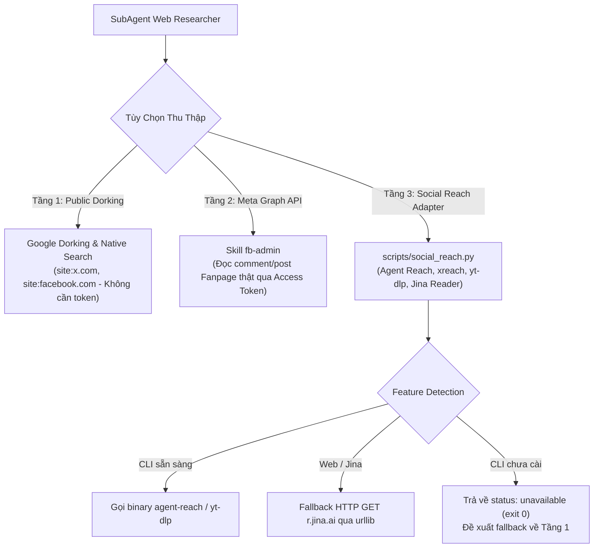

# Hướng Dẫn Tầng Thu Thập Nâng Cao: Social Reach Adapter

Tài liệu hướng dẫn triển khai, vận hành và đảm bảo an toàn cho Tầng Thu Thập Dữ Liệu Nâng Cao (Advanced Collection Layer) phục vụ SubAgent **Web & Market Intelligence Researcher** trong Antigravity Harness Hub.

---

## 1. Kiến Trúc Lai Đa Tầng (Multi-Tier Social & Web Intel)

Để đảm bảo khả năng trinh sát thị trường và lắng nghe tiếng nói khách hàng (Voice of Customer) liên tục mà không bị gián đoạn khi thiếu API key hoặc bị chặn tường lửa, hệ thống vận hành theo kiến trúc lai 3 tầng bổ trợ:



1. **Tầng 1 (Public Dorking & Native Search):**
   - Sử dụng Google Dorking (`site:facebook.com`, `site:instagram.com`, `site:x.com`, `site:reddit.com`) qua công cụ tìm kiếm chuẩn (`search_web`).
   - Hoàn toàn miễn phí, không yêu cầu token hay thông tin đăng nhập.
2. **Tầng 2 (Meta Graph API):**
   - Kết nối trực tiếp với Fanpage thông qua kỹ năng `fb-admin` và script `plugins/marketing/skills/fb-admin/scripts/fb_api.py`.
   - Thu thập bài viết, bình luận thật của khách hàng phục vụ phân tích VoC và sentiment.
3. **Tầng 3 (Social Reach Adapter — `scripts/social_reach.py`):**
   - Cung cấp giao diện chuẩn hóa truy cập mạng xã hội (Twitter/X, Reddit, YouTube, Web).
   - Tự động phát hiện CLI (`agent-reach`, `xreach`, `yt-dlp`).
   - Tự động fallback sang Jina Reader (`r.jina.ai`) thông qua thư viện chuẩn `urllib.request` nếu cần đọc nội dung bài viết/trang web mà không cần cài thêm package bên thứ ba.
   - Trả về mã thoát `0` kèm hướng dẫn fallback rõ ràng khi công cụ ngoại vi chưa sẵn sàng, ngăn chặn tối đa lỗi crash gián đoạn chu trình Maker-Checker.

---

## 2. Cài Đặt Tùy Chọn Agent Reach

Agent Reach là công cụ mở rộng tùy chọn. Môi trường Antigravity không bắt buộc phải cài đặt sẵn Agent Reach để hoạt động.

### Khuyến nghị cài đặt bằng `pipx` (Tách biệt môi trường)
Để tránh xung đột dependency với mã nguồn dự án:

```bash
# Cài đặt pipx (nếu chưa có)
python -m pip install --user pipx
python -m pipx ensurepath

# Cài đặt Agent Reach trong môi trường cô lập
pipx install agent-reach

# (Tùy chọn) Cài đặt yt-dlp phục vụ trích xuất YouTube metadata
pipx install yt-dlp
```

### Cài đặt trong Virtual Environment riêng biệt
Nếu không sử dụng `pipx`, hãy tạo một virtual environment độc lập nằm ngoài thư mục repository:

```bash
# Tạo venv riêng bên ngoài repo
python -m venv ~/.venvs/agent-reach
~/.venvs/agent-reach/bin/pip install agent-reach yt-dlp
```

---

## 3. Nguyên Tắc An Toàn & Quản Lý Danh Tính (Security & Identity)

Khi tương tác với các nền tảng mạng xã hội yêu cầu phiên đăng nhập, việc tuân thủ các quy tắc an toàn bảo mật sau đây là bắt buộc:

### Lưu Trữ Cookie Tập Trung
- Tất cả các token phiên đăng nhập và cookie mạng xã hội phải được lưu trữ riêng biệt tại thư mục người dùng:
  `~/.agent-reach/` (ví dụ trên Windows: `C:\Users\<Username>\.agent-reach\`).
- **CẤM TUYỆT ĐỐI** lưu trữ file cookie, credentials hoặc `.env` chứa token mạng xã hội bên trong thư mục repository của dự án.

### Bắt Buộc Sử Dụng Tài Khoản Clone (Secondary Accounts)
> [!CAUTION]
> **Tuyệt đối không sử dụng tài khoản cá nhân chính (Primary Account) để đăng nhập hoặc lấy cookie cho crawler/bot.**
- Luôn tạo và sử dụng **tài khoản phụ (clone/burner account)** dành riêng cho mục đích nghiên cứu và thu thập dữ liệu.
- Các nền tảng xã hội (đặc biệt là X/Twitter, Reddit) có thuật toán tự động nhận diện và khóa/checkpoint các tài khoản có hành vi truy vấn dữ liệu bất thường. Việc dùng tài khoản clone bảo vệ danh tính và dữ liệu cá nhân của người dùng.

### Cơ Chế Zero Token Leakage
- Script `scripts/social_reach.py` tích hợp sẵn bộ lọc `redact_sensitive_data()`.
- Toàn bộ tham số nhạy cảm như `auth_token`, `ct0`, `sessionid`, `cookie`, `access_token`, `api_key` đều được bóc tách và thay thế bằng `[REDACTED]` trước khi in ra stdout/stderr hoặc lưu vào Research Dossier.

---

## 4. Hướng Dẫn Sử Dụng CLI `social_reach.py`

### Cú Pháp Lệnh
```bash
python scripts/social_reach.py --platform {twitter,reddit,youtube,web,jina,doctor} [--query <query>] [--url <url>] [--json] [--timeout <giây>]
```

### Các Lệnh Thực Chiến

1. **Kiểm tra trạng thái sẵn sàng của hệ thống (Doctor Mode):**
   ```bash
   python scripts/social_reach.py --platform doctor --json
   ```
   *Kết quả trả về danh sách các binary đã cài đặt, trạng thái thư mục cookie và đề xuất fallback cho từng nền tảng.*

2. **Thu thập nội dung web/bài viết qua Jina Reader Fallback:**
   ```bash
   python scripts/social_reach.py --platform jina --url https://example.com/article --json
   ```
   *Tự động gửi HTTP GET đến `https://r.jina.ai/...` bằng `urllib` có kèm User-Agent chuẩn và xuất văn bản sạch.*

3. **Trinh sát X/Twitter (Khi đã cấu hình Agent Reach hoặc xreach):**
   ```bash
   python scripts/social_reach.py --platform twitter --query "AI Marketing" --json
   ```

4. **Trường hợp công cụ chưa cài đặt (Graceful Fallback):**
   Nếu máy trạm chưa cài CLI, lệnh sẽ trả về:
   ```json
   {
     "status": "unavailable",
     "platform": "twitter",
     "limitations": "Agent-Reach CLI not installed or platform offline",
     "fallback_suggested": "Use Google Dorking: site:x.com or site:twitter.com via search_web"
   }
   ```
   Với exit code `0`, SubAgent Web Researcher có thể đọc kết quả này và chuyển ngay sang Google Dorking mà không gây crash pipeline.
