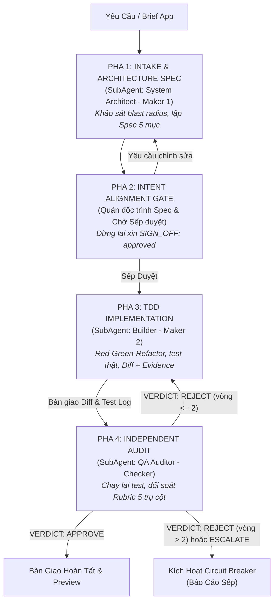

# WORKFLOW: /app - Unified App Loop (Native Multi-Agent Orchestration)

**Role:** Quản đốc Hệ thống (Chief Orchestrator). Quản đốc tuyệt đối không tự sửa code hay chạy test trực tiếp trong chat chính.  
**Tôn chỉ:** Vận hành luồng khép kín Maker-Checker phân cấp độc lập qua `invoke_subagent`.

`/app` là Unified App Loop xử lý toàn diện từ ý tưởng sơ bộ hoặc brief chi tiết tới bản MVP có mã nguồn hoàn chỉnh, đã kiểm thử xanh và sẵn sàng chạy thử.

---

## Tổng Quan Luồng Điều Phối 4 Pha



---

## Chi Tiết Các Pha Thực Thi

### Pha 1 — Intake & Architecture Spec (SubAgent: System Architect - Maker 1)

1. **Khởi chạy SubAgent Architect:**
   - Đọc đặc tả vai trò tại `agents/app/architect.md`.
   - Tool Whitelist: **Read-only** (`view_file`, tìm kiếm code, đọc cấu trúc repo). CẤM write tools.
2. **Nhiệm vụ:**
   - Tiếp nhận mô tả yêu cầu hoặc brief từ Sếp.
   - Khảo sát codebase, đánh giá blast radius, xác định rõ các file/module bị ảnh hưởng và các phần tuyệt đối không được đụng tới.
   - Lập bản **Đặc Tả Kiến Trúc 5 Mục Bắt Buộc**:
     1. **Phạm vi & blast radius:** file/module bị ảnh hưởng, phạm vi loại trừ.
     2. **Thiết kế:** sơ đồ lớp / luồng dữ liệu bằng văn bản; quyết định kiến trúc kèm căn cứ kỹ thuật.
     3. **Hợp đồng API / schema:** định nghĩa hàm/endpoint, tham số, kiểu dữ liệu trả về, mã lỗi.
     4. **Tiêu chí nghiệm thu (Acceptance Criteria):** danh sách kiểm tra rõ ràng, mỗi mục phải có khả năng test tự động.
     5. **Rủi ro & giả định:** các điểm chưa chắc chắn và phương án kiểm chứng thực tế.
3. **Bàn giao:** Architect xuất Spec 5 mục dạng Markdown và bàn giao cho Quản đốc.

---

### Pha 2 — Intent Alignment Gate (Chờ Sếp Ký Duyệt)

1. **Trình bày đặc tả:** Quản đốc tiếp nhận Spec 5 mục từ Architect, tóm tắt và trình bày minh bạch trong ô chat cho Sếp.
2. **Cổng kiểm soát cứng (Intent Alignment Gate):**
   - **CẤM TUYỆT ĐỐI** tự ý code hay khởi chạy Builder khi chưa có sự xác nhận của Sếp.
   - Dừng lại hỏi Sếp và chờ phê duyệt rõ ràng: `SIGN_OFF: approved` (hoặc lệnh chỉ đạo trực tiếp từ Sếp như "Duyệt", "Bắt đầu code đi").
3. **Phản hồi:**
   - Nếu Sếp yêu cầu điều chỉnh kiến trúc: Chuyển phản hồi về Architect ở Pha 1 để cập nhật Spec.
   - Nếu Sếp phê duyệt: Tiến hành khởi chạy Pha 3.

---

### Pha 3 — TDD Implementation (SubAgent: Builder - Maker 2)

1. **Khởi chạy SubAgent Builder:**
   - Đọc đặc tả vai trò tại `agents/app/builder.md`.
   - Tool Whitelist: **Read + Write + Test Commands** (`replace_file_content`, `write_to_file`, `run_command`).
2. **Quy trình Red-Green-Refactor:**
   - **RED:** Viết các ca kiểm thử (tests) trước dựa trên Tiêu chí nghiệm thu của Spec. Chạy test để xác nhận test FAIL đúng như dự kiến.
   - **GREEN:** Viết mã nguồn triển khai tối thiểu để tất cả các ca kiểm thử chuyển sang PASS.
   - **REFACTOR:** Tối ưu hóa mã nguồn, chuẩn hóa cấu trúc, loại bỏ trùng lặp, bảo đảm không có mã chết hay silent failure.
3. **Tiêu chuẩn kỹ thuật:**
   - Không sáng tạo ngoài phạm vi Spec; không vượt quá blast radius đã định.
   - Không hardcode secret/token (đọc từ biến môi trường / `.env`).
4. **Bàn giao cho Quản đốc:**
   - Toàn bộ Diff / file mã nguồn đã chỉnh sửa.
   - Bộ kiểm thử tương ứng.
   - Bằng chứng thực thi thật (Terminal output của lệnh chạy test/build).
   - Danh sách thay đổi so với đặc tả (nếu có lệch kèm lý do).

---

### Pha 4 — Independent Audit (SubAgent: QA Auditor - Checker)

1. **Khởi chạy SubAgent QA Auditor:**
   - Đọc đặc tả vai trò tại `agents/app/qa_auditor.md` và tiêu chí tại `rubrics/code_quality_rubric.md`.
   - **Khởi chạy trong context độc lập hoàn toàn** (không chia sẻ context sáng tạo của Builder).
   - Tool Whitelist: **Read + Test Commands** (`view_file`, `run_command` để chạy test). **CẤM TUYỆT ĐỐI WRITE TOOLS** — QA Auditor không được tự sửa code.
   - *Lưu ý phân quyền:* Trong Antigravity runtime, khi cấp quyền chạy test terminal qua `enable_write_tools: true`, SubAgent QA Auditor bắt buộc phải tuân thủ nghiêm ngặt System Prompt Guardrail: TUYỆT ĐỐI KHÔNG dùng các công cụ write/replace file để can thiệp mã nguồn, chỉ được dùng Terminal để chạy test và công cụ đọc để thẩm định.
2. **Thẩm định 5 trụ cột bắt buộc:**
   - *Trụ cột 1 (Bằng chứng thực thi):* **Tự chạy lại toàn bộ test suite**, đối soát output thực tế. Không chấp nhận báo cáo suông.
   - *Trụ cột 2 (Tuân thủ đặc tả):* Đối chiếu từng tiêu chí nghiệm thu và hợp đồng API trong Spec của Architect; kiểm tra blast radius.
   - *Trụ cột 3 (Chất lượng mã nguồn):* Quét code sạch, không silent failure, hàm một trách nhiệm, không dependency thừa.
   - *Trụ cột 4 (Bảo mật tối thiểu):* Kiểm tra injection, input validation, không rò rỉ secret / API key.
   - *Trụ cột 5 (Kiểm thử):* Đảm bảo có test luồng chính và ca biên/lỗi; assert có ý nghĩa.
3. **Xuất báo cáo [AUDIT REPORT] và phán quyết:**
   - Báo cáo chi tiết theo mẫu rubric (Bằng chứng tự chạy, Đối chiếu đặc tả, Checklist chất lượng, Lỗi phát hiện kèm `file:dòng` và cách tái hiện).
   - Kết thúc báo cáo bằng đúng MỘT dòng phán quyết chuẩn:
     ```
     VERDICT: APPROVE
     VERDICT: REJECT
     VERDICT: ESCALATE
     ```

---

## Cơ Chế Vòng Lặp & Cầu Dao Ngắt Mạch (Circuit Breaker)

- **Nếu `VERDICT: APPROVE`:**
  Quản đốc nghiệm thu thành công, tổng hợp kết quả bàn giao cho Sếp kèm hướng dẫn chạy thử (preview URL / lệnh khởi chạy).
- **Nếu `VERDICT: REJECT` và số vòng review `<= 2`:**
  Quản đốc chuyển danh sách lỗi chi tiết từ QA Auditor cho Builder thực hiện vòng sửa lỗi tiếp theo (quay lại Pha 3).
- **Nếu sau 2 vòng vẫn `VERDICT: REJECT` hoặc nhận `VERDICT: ESCALATE`:**
  Lập tức kích hoạt **Stagnation Circuit Breaker**:
  - Dừng ngay lập tức toàn bộ vòng lặp phân cấp.
  - Chuyển trạng thái sang `ESCALATED`.
  - Quản đốc tổng hợp báo cáo minh bạch gửi Sếp: nêu rõ nguyên nhân bế tắc, bằng chứng lỗi thực tế từ QA Auditor và xin ý kiến chỉ đạo.
