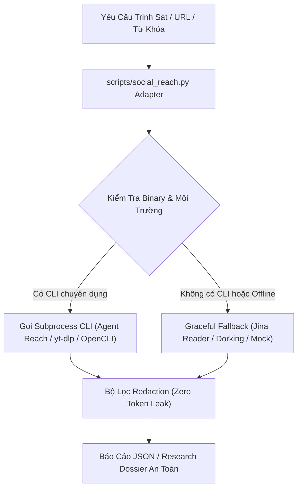

# Social Reach — Trinh Sát Đa Nền Tảng Mạng Xã Hội & Web (`/social-reach`)

Kỹ năng trinh sát thị trường và thu thập nội dung đa nền tảng dành cho SubAgent Web Researcher và Marketer trong Antigravity Harness Hub. Tích hợp kiến trúc lai kết hợp các công cụ CLI chuyên dụng (Agent Reach, yt-dlp, OpenCLI, rdt-cli, bili-cli) cùng Jina Reader fallback.

---

## 1. Tổng Quan Kiến Trúc & Nguyên Tắc Vận Hành



### Nguyên Tắc Bất Biến:
1. **Zero Token Leak:** Mọi `auth_token`, `ct0`, `sessionid`, cookie, API key đều được tự động bóc tách và che giấu thành `[REDACTED]` trước khi xuất ra màn hình hoặc ghi vào hồ sơ.
2. **Cookie Local-Only:** Cookie phiên làm việc chỉ được lưu cục bộ tại thư mục người dùng (`~/.agent-reach/`), **tuyệt đối KHÔNG commit cookie vào git repository**.
3. **Graceful Fallback:** Khi công cụ CLI chưa được cài đặt hoặc môi trường mạng gặp sự cố, hệ thống trả về thông báo giới hạn kèm gợi ý phương án thay thế, **không bao giờ để crash chương trình**.
4. **Clone Account First:** Khuyến nghị luôn sử dụng tài khoản clone / phụ để xuất session cookie crawler, bảo vệ an toàn cho tài khoản chính.

---

## 2. Hướng Dẫn Sử Dụng Theo Từng Nền Tảng

Bộ điều phối sử dụng file adapter `scripts/social_reach.py` tại gốc repo để chuẩn hóa đầu vào và đầu ra.

### 2.1 Kiểm Tra Sức Khỏe Toàn Bộ Công Cụ (`doctor`)
Kiểm tra xem hệ thống đã cài đặt những CLI nào và trạng thái sẵn sàng của các nền tảng:

```bash
python scripts/social_reach.py --platform doctor --json
```

---

### 2.2 Twitter / X (Twitter-CLI / Agent Reach / xreach)
- **Mục tiêu:** Thu thập tweets, threads, profile đối thủ, tìm kiếm từ khóa, hashtag thịnh hành.
- **Yêu cầu cookie:** `auth_token` và `ct0` trong cấu hình local.
- **Lệnh thực thi:**

```bash
python scripts/social_reach.py --platform twitter --query "AI agent workflow"
```

Hoặc trích xuất nội dung từ URL bài đăng cụ thể:

```bash
python scripts/social_reach.py --platform twitter --url "https://x.com/username/status/123456789"
```

- **Phương án Fallback:** Sử dụng Google Dorking cú pháp `site:x.com` hoặc `site:twitter.com` qua công cụ tìm kiếm web.

---

### 2.3 YouTube Subtitles & Transcripts (yt-dlp)
- **Mục tiêu:** Bóc tách toàn bộ phụ đề (subtitles/transcripts), metadata (view, like, mô tả, tags) của video để phân tích nội dung chuyên sâu.
- **Lệnh thực thi:**

```bash
python scripts/social_reach.py --platform youtube --url "https://www.youtube.com/watch?v=dQw4w9WgXcQ"
```

- **Phương án Fallback:** Sử dụng kỹ năng `/yt-competitor-analyzer` hoặc tìm kiếm thông tin video qua web search.

---

### 2.4 Reddit Posts & Comments (OpenCLI / rdt-cli)
- **Mục tiêu:** Quét các bài thảo luận nổi bật (hot posts), chuỗi bình luận (comment tree), tìm Voice of Customer (nỗi đau, mong muốn thực tế).
- **Lệnh thực thi:**

```bash
python scripts/social_reach.py --platform reddit --query "best productivity tools 2026"
```

Hoặc quét bài viết cụ thể:

```bash
python scripts/social_reach.py --platform reddit --url "https://reddit.com/r/technology/comments/xyz123"
```

- **Phương án Fallback:** Dùng Google Dorking `site:reddit.com/r/<subreddit>` qua web search.

---

### 2.5 Bilibili (bili-cli / OpenCLI)
- **Mục tiêu:** Thu thập thông tin video, danmaku (bình luận chạy trên màn hình), phụ đề và bình luận video Bilibili (qua BV ID).
- **Lệnh thực thi:**

```bash
python scripts/social_reach.py --platform bilibili --query "BV1xx411c7X"
```

- **Phương án Fallback:** Dùng Google Dorking `site:bilibili.com` hoặc chuyển đổi link qua Jina Reader.

---

### 2.6 XiaoHongShu / Tiểu Hồng Thư (OpenCLI / xiaohongshu-mcp)
- **Mục tiêu:** Khám phá xu hướng, phong cách thị giác, các bài đăng ghi chú (notes) và phản hồi của người tiêu dùng trên Tiểu Hồng Thư.
- **Lệnh thực thi:**

```bash
python scripts/social_reach.py --platform xiaohongshu --query "skincare routine review"
```

- **Phương án Fallback:** Tìm kiếm qua Google Dorking `site:xiaohongshu.com` hoặc Jina Reader.

---

### 2.7 Facebook & Instagram (OpenCLI)
- **Mục tiêu:** Trích xuất bài đăng công khai, nội dung Reels/Captions để nghiên cứu đối thủ cạnh tranh.
- **Lệnh thực thi:**

```bash
python scripts/social_reach.py --platform facebook --query "khóa học AI marketing"
python scripts/social_reach.py --platform instagram --query "fashion trends 2026"
```

- **Ghi chú:** Để quản lý Fanpage đăng bài/đọc comment có API chính thống, sử dụng kỹ năng `/fb-admin`.

---

### 2.8 Web Reader (Jina Reader)
- **Mục tiêu:** Trích xuất nội dung văn bản sạch (dạng Markdown) từ bất kỳ trang web hoặc bài báo nào, bỏ qua quảng cáo và CSS rườm rà.
- **Lệnh thực thi:**

```bash
python scripts/social_reach.py --platform jina --url "https://example.com/article"
```

Hoặc tìm kiếm trực tiếp qua cổng Jina Search:

```bash
python scripts/social_reach.py --platform jina --query "Antigravity multi-agent systems"
```

---

### 2.9 Podcast Xiaoyuzhou (Audio Transcripts / RSS)
- **Mục tiêu:** Thu thập show notes và bóc tách nội dung trò chuyện từ các tập podcast trên nền tảng Xiaoyuzhou (Tiểu Vũ Trụ) hoặc RSS.
- **Lệnh thực thi:**

```bash
python scripts/social_reach.py --platform podcast --url "https://www.xiaoyuzhoufm.com/episode/123456"
```

- **Phương án Fallback:** Trích xuất show notes qua Jina Reader bằng URL tập podcast.

---

## 3. Checklist An Toàn & Bảo Mật Dành Cho SubAgent

Trước khi hoàn tất hồ sơ Research Dossier:
- [ ] Không có cookie nào được ghi vào mã nguồn hoặc file báo cáo.
- [ ] Dữ liệu trích xuất đã đi qua hàm `redact_sensitive_data()`.
- [ ] Mọi con số và trích dẫn đều có nguồn rõ ràng kèm URL tương ứng.
- [ ] Khi gặp lỗi nền tảng offline, ghi nhận trạng thái `unavailable` rõ ràng thay vì suy đoán dữ liệu.
